## GOAL

This script performs analysis of the google trends data for Brazil to develop an alarm system for covid19 cases at the state level.


```r
#user's file path
if(Sys.info()[["user"]] == "wb537287") dropbox_file_path <- "/Users/wb537287/Dropbox/COVID Social Media Analysis/"

#import data
trends_df <- 
  readRDS(file.path(dropbox_file_path, "Data/google_trends/FinalData/brazil_with_refstate_analysis.Rds"))

library(ggrepel)
```

```
## Loading required package: ggplot2
```

```
## Warning: package 'ggplot2' was built under R version 3.6.3
```

```r
library(tidyverse)
```

```
## -- Attaching packages --------------------------------------- tidyverse 1.3.0 --
```

```
## v tibble  3.0.1     v dplyr   0.8.5
## v tidyr   1.0.2     v stringr 1.4.0
## v readr   1.3.1     v forcats 0.5.0
## v purrr   0.3.4
```

```
## Warning: package 'tibble' was built under R version 3.6.3
```

```
## Warning: package 'tidyr' was built under R version 3.6.3
```

```
## Warning: package 'purrr' was built under R version 3.6.3
```

```
## Warning: package 'dplyr' was built under R version 3.6.3
```

```
## Warning: package 'forcats' was built under R version 3.6.3
```

```
## -- Conflicts ------------------------------------------ tidyverse_conflicts() --
## x dplyr::filter() masks stats::filter()
## x dplyr::lag()    masks stats::lag()
```

```r
library(parallel)
library(pbmcapply)
library(ggplot2)
library(jsonlite)
```

```
## Warning: package 'jsonlite' was built under R version 3.6.3
```

```
## 
## Attaching package: 'jsonlite'
```

```
## The following object is masked from 'package:purrr':
## 
##     flatten
```

```r
library(stringr)
library(raster)
```

```
## Warning: package 'raster' was built under R version 3.6.3
```

```
## Loading required package: sp
```

```
## 
## Attaching package: 'raster'
```

```
## The following object is masked from 'package:dplyr':
## 
##     select
```

```
## The following object is masked from 'package:tidyr':
## 
##     extract
```

```r
library(ISOcodes)
```

```
## Warning: package 'ISOcodes' was built under R version 3.6.3
```

```r
library(stringi)
library(lubridate)
```

```
## Warning: package 'lubridate' was built under R version 3.6.3
```

```
## 
## Attaching package: 'lubridate'
```

```
## The following objects are masked from 'package:raster':
## 
##     intersect, union
```

```
## The following objects are masked from 'package:dplyr':
## 
##     intersect, setdiff, union
```

```
## The following objects are masked from 'package:base':
## 
##     date, intersect, setdiff, union
```

```r
library(purrr)
library(tidytext)
```

```
## Warning: package 'tidytext' was built under R version 3.6.3
```

```r
library(quanteda)
```

```
## Warning: package 'quanteda' was built under R version 3.6.3
```

```
## Package version: 2.0.1
```

```
## Parallel computing: 2 of 8 threads used.
```

```
## See https://quanteda.io for tutorials and examples.
```

```
## 
## Attaching package: 'quanteda'
```

```
## The following object is masked from 'package:utils':
## 
##     View
```

```r
library(SentimentAnalysis)
```

```
## Warning: package 'SentimentAnalysis' was built under R version 3.6.3
```

```
## 
## Attaching package: 'SentimentAnalysis'
```

```
## The following object is masked from 'package:base':
## 
##     write
```

```r
library(sentimentr)
```

```
## Warning: package 'sentimentr' was built under R version 3.6.3
```

```r
library(tm)
```

```
## Warning: package 'tm' was built under R version 3.6.3
```

```
## Loading required package: NLP
```

```
## 
## Attaching package: 'NLP'
```

```
## The following objects are masked from 'package:quanteda':
## 
##     meta, meta<-
```

```
## The following object is masked from 'package:ggplot2':
## 
##     annotate
```

```
## 
## Attaching package: 'tm'
```

```
## The following objects are masked from 'package:quanteda':
## 
##     as.DocumentTermMatrix, stopwords
```

```r
library(tokenizers)
```

```
## Warning: package 'tokenizers' was built under R version 3.6.3
```

```r
library(wordcloud)
```

```
## Warning: package 'wordcloud' was built under R version 3.6.3
```

```
## Loading required package: RColorBrewer
```

```r
library(ggwordcloud)
```

```
## Warning: package 'ggwordcloud' was built under R version 3.6.3
```

```r
library(ggpubr)
```

```
## Warning: package 'ggpubr' was built under R version 3.6.3
```

```
## Loading required package: magrittr
```

```
## 
## Attaching package: 'magrittr'
```

```
## The following object is masked from 'package:raster':
## 
##     extract
```

```
## The following object is masked from 'package:purrr':
## 
##     set_names
```

```
## The following object is masked from 'package:tidyr':
## 
##     extract
```

```
## 
## Attaching package: 'ggpubr'
```

```
## The following object is masked from 'package:raster':
## 
##     rotate
```

```r
library(dplyr)
library(sf)
```

```
## Warning: package 'sf' was built under R version 3.6.3
```

```
## Linking to GEOS 3.6.1, GDAL 2.2.3, PROJ 4.9.3
```

```r
library(readstata13)
```

```
## Warning: package 'readstata13' was built under R version 3.6.3
```

```r
library(forcats)
library(tidyr)
library(tidylog)
```

```
## 
## Attaching package: 'tidylog'
```

```
## The following objects are masked from 'package:ggpubr':
## 
##     group_by, mutate
```

```
## The following object is masked from 'package:raster':
## 
##     select
```

```
## The following objects are masked from 'package:dplyr':
## 
##     add_count, add_tally, anti_join, count, distinct, distinct_all,
##     distinct_at, distinct_if, filter, filter_all, filter_at, filter_if,
##     full_join, group_by, group_by_all, group_by_at, group_by_if,
##     inner_join, left_join, mutate, mutate_all, mutate_at, mutate_if,
##     rename, rename_all, rename_at, rename_if, right_join, sample_frac,
##     sample_n, select, select_all, select_at, select_if, semi_join,
##     slice, summarise, summarise_all, summarise_at, summarise_if,
##     summarize, summarize_all, summarize_at, summarize_if, tally,
##     top_frac, top_n, transmute, transmute_all, transmute_at,
##     transmute_if, ungroup
```

```
## The following objects are masked from 'package:tidyr':
## 
##     drop_na, fill, gather, pivot_longer, pivot_wider, replace_na,
##     spread, uncount
```

```
## The following object is masked from 'package:stats':
## 
##     filter
```

Adjusting the dataset

```r
#renaming state variable name to "state" so that it matches previous code
trends_df <- 
  trends_df %>% 
  rename(state = name)
```

```
## rename: renamed one variable (state)
```


# Covid-19 per state

Total number of cases across states

```r
trends_df %>% 
  filter(!is.na(state), !is.na(cases)) %>% 
  count(cases, date, state) %>% 
  ggplot() +
  geom_line(aes(date, cases, group = state, color = fct_reorder2(state, date, cases))) +
  labs(
    title = "Cases per State",
    color = "State"
  )
```

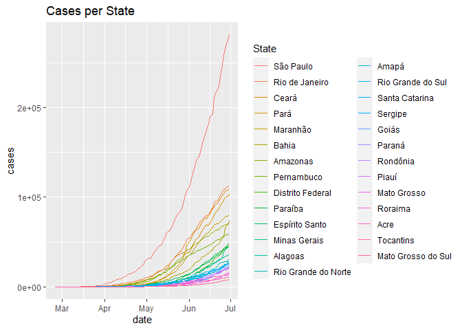<!-- -->

Total number of deaths across states


```r
trends_df %>% 
  filter(!is.na(state), !is.na(cases)) %>% 
  count(deaths, date, state) %>% 
  ggplot() +
  geom_line(aes(date, deaths, group = state, color = fct_reorder2(state, date, deaths))) +
  labs(
    title = "Deaths per State",
    color = "State"
  )
```

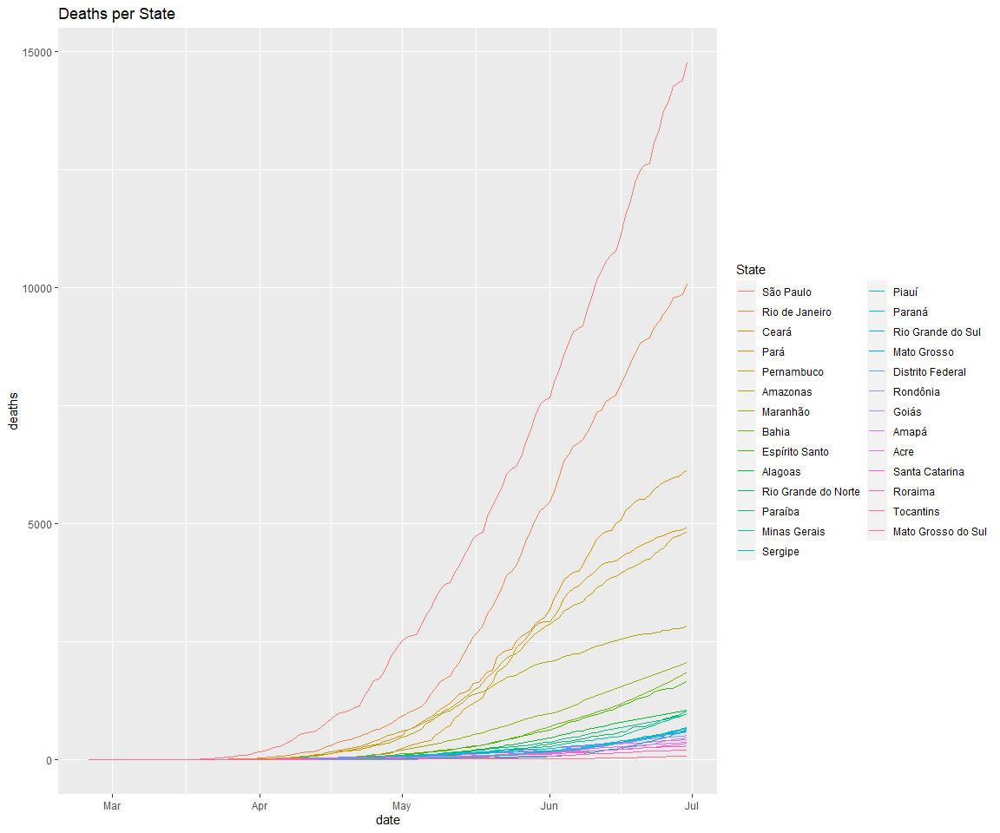<!-- -->

Case rate per state

```r
trends_df %>% 
  filter(!is.na(state), !is.na(case_rate)) %>% 
  count(case_rate, date, state) %>% 
  ggplot() +
  geom_line(aes(date, case_rate, group = state, color = fct_reorder2(state, date, case_rate))) +
  labs(
    title = "Case rate per State",
    color = "State"
  )
```

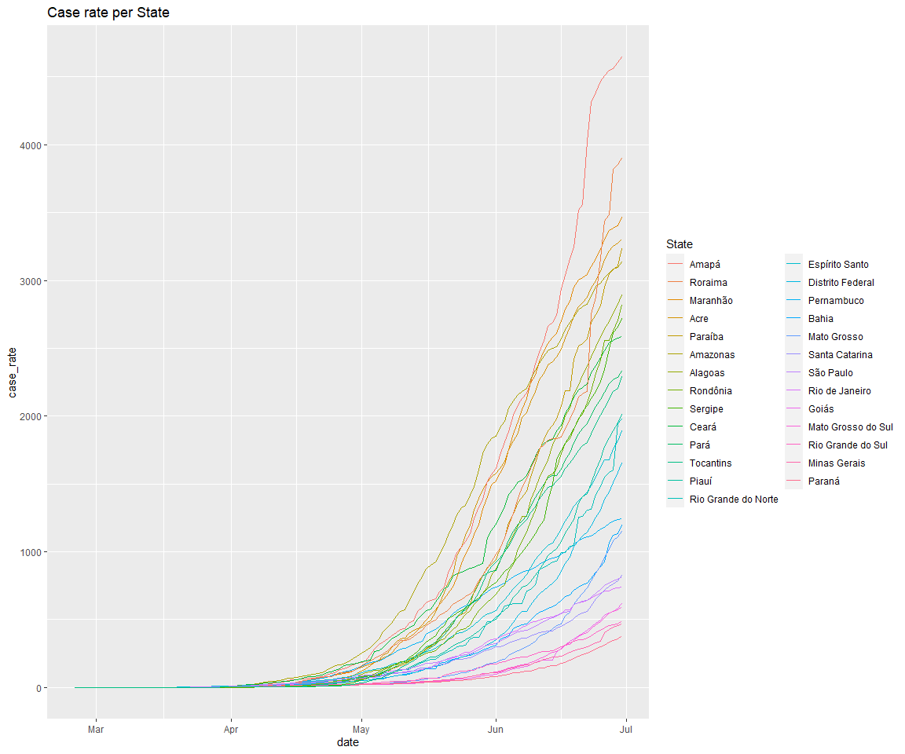<!-- -->

Death rate per state

```r
trends_df %>% 
  filter(!is.na(state), !is.na(death_rate)) %>% 
  count(death_rate, date, state) %>% 
  ggplot() +
  geom_line(aes(date, death_rate, group = state, color = fct_reorder2(state, date, death_rate))) +
  labs(
    title = "Death rate per State",
    color = "State"
  )
```

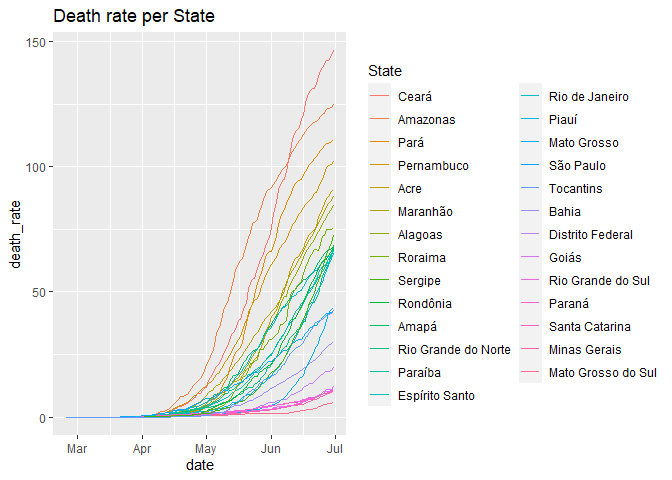<!-- -->

# Overall evolution of searches v. trends

```r
main_keywords <- c("como tratar o coronavírus", "febre", "tosse")

trends_df %>% 
  filter(!is.na(categories), categories %in% c("virus", "symptoms", "in_1st_person"), !is.na(state)) %>% 
  group_by(categories, date) %>% 
  summarize(
    mean_hits = mean(hits, na.rm = TRUE), 
    mean_growth_rate_cases = mean(growth_rate_cases)
  ) %>% 
  ggplot() + 
  geom_line(aes(date, mean_hits, group = categories, color = fct_reorder2(categories, date, mean_hits)), size = 1.2) +
  geom_line(data = . %>% filter(categories == "in_1st_person"), aes(date, mean_growth_rate_cases, group = 1), size = 1.1) + 
  labs(
    y = "Average hits per category", 
    x = "Date",
    title = "Average growth rate of cases (in black)\nin comparison to Google Trends over time", 
    caption = "Using hits - not relative to another state"
  ) + 
  coord_cartesian(ylim = c(0, 100)) +
  scale_color_discrete(name = "Search Category", labels = c("Coronavirus", "Symptoms", "1st Person Search")) +
  theme_light() + 
  theme(plot.title = element_text(hjust = 0.55)) 
```

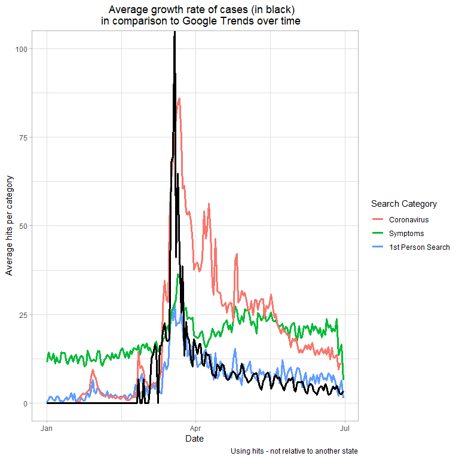<!-- -->

# Correlation between average of main keywords and case rate

We now explore if the average of tosse, febre and como tratar o coronavirus is a better predictor of cases


```r
main_keywords <- c("como tratar o coronavírus", "febre", "tosse")

trends_df %>% 
  filter(categories %in% c("in_1st_person", "symptoms"), date > "2020-02-29") %>% 
  group_by(state, week_number) %>% 
  summarize(
    mean_hits = mean(hits_adj, na.rm = TRUE), 
    case_rate = mean(case_rate, na.rm = TRUE)
  ) %>% 
  ggplot() + 
  geom_point(aes(case_rate, mean_hits)) + 
  geom_smooth(aes(case_rate, mean_hits), method = "lm") + 
  geom_text_repel(
    data = . %>% filter(mean_hits > 75), 
    aes(case_rate, mean_hits, label = state), 
    hjust=0.5, vjust=0.4
  ) + 
  facet_wrap(vars(week_number), scales = "free_x") +
  labs(
    caption = "Keywords used: 'febre', 'tosse', and 'como tratar o coronavirus'; Using hits_adj; zooming in y<3"
  ) +
  coord_cartesian(ylim = c(0, 3))
```

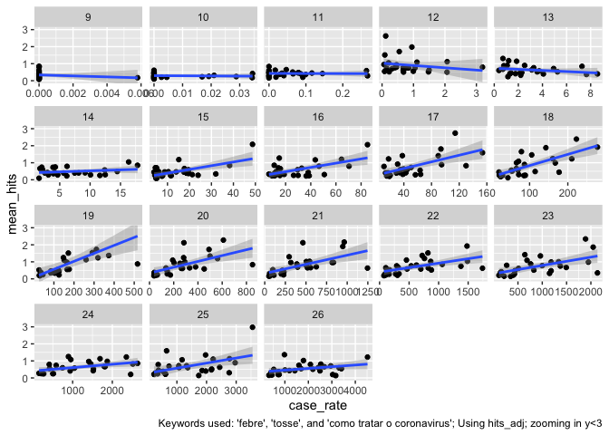<!-- -->

## Correlation between average of 3 main keywords and case rate


```r
main_keywords <- c("como tratar o coronavírus", "febre", "tosse")

trends_df %>%
  filter(!is.na(hits), keyword %in% main_keywords) %>% 
  group_by(state) %>%
  summarize(
    average_hits = mean(hits_adj, na.rm = TRUE), 
    case_rate = mean(case_rate, na.rm = TRUE)
  ) %>% 
  ggplot() + 
  geom_point(aes(case_rate, average_hits)) +
  geom_smooth(aes(case_rate, average_hits), method = "lm") +
  geom_label_repel(
    data = . %>% filter(case_rate > 500 | average_hits > 0.5), 
    aes(case_rate, average_hits, label = state), 
    hjust=0.5, vjust=0.4
  ) + 
  theme_light()
```

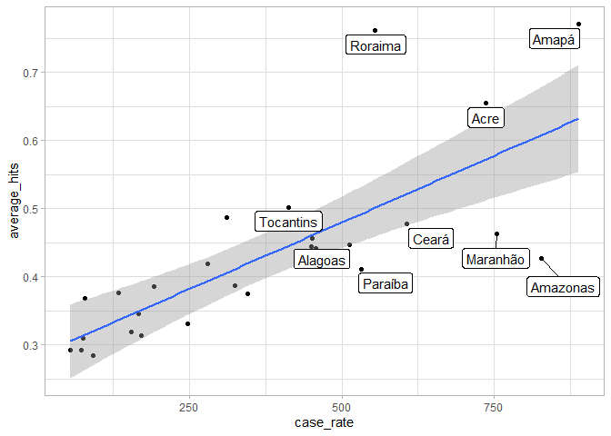<!-- -->


# Focus on "I can't smell" = "Perdi o olfato"  

## Case rate against searches for I can't smell


```r
trends_df %>% 
  filter(keyword == "perdi o olfato", date > "2020-02-29") %>% 
  group_by(state, week_number) %>% 
  summarize(
    mean_hits = mean(hits_adj, na.rm = TRUE), 
    case_rate = mean(case_rate, na.rm = TRUE)
  ) %>% 
  ggplot() + 
  geom_point(aes(case_rate, mean_hits)) + 
  geom_smooth(aes(case_rate, mean_hits), method = "lm") + 
  geom_text_repel(
    data = . %>% filter(mean_hits > 1), 
    aes(case_rate, mean_hits, label = state), 
    hjust=0.5, vjust=0.4
  ) + 
  facet_wrap(vars(week_number), scales = "free_x") +
  labs(
    caption = "Keywords used: 'I can't smell'; Using hits_adj"
  )
```

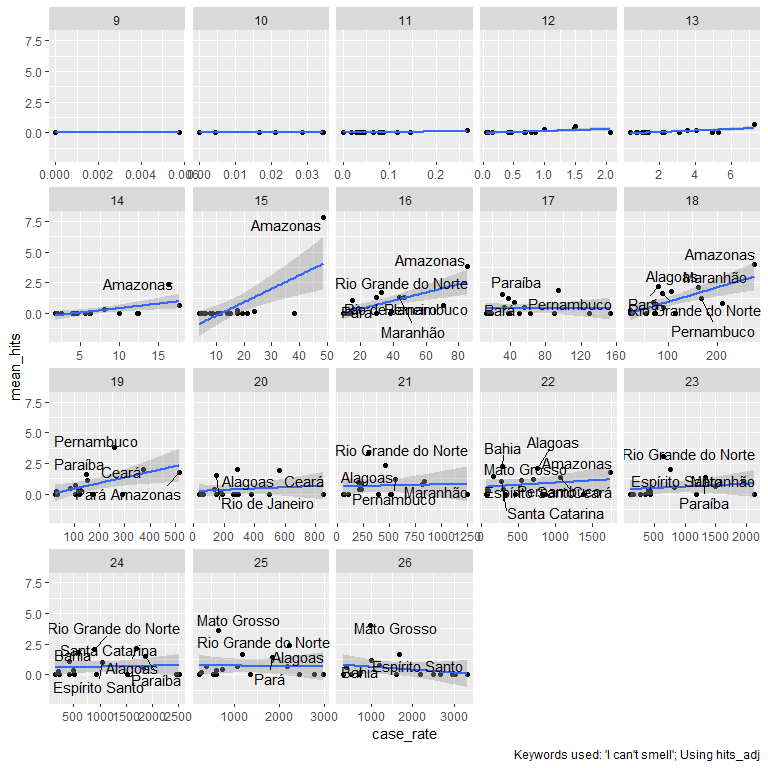<!-- -->


# Case rate and death rate per state

Find states that show up under “I can’t smell”


```r
states_cant_smell <-  
  trends_df %>% 
  filter(keyword == "perdi o olfato", hits_adj > 0) %>% 
  filter(!is.na(hits_adj)) %>% 
  count(state) %>%
  pull(state)
```

Find the date in which the state first shows under “I can’t smell”


```r
states_cant_smell_date <- 
  trends_df %>% 
  filter(keyword == "perdi o olfato", state %in% states_cant_smell, hits_adj > 0) %>% 
  filter(!is.na(hits_adj), date> "2020-03-01") %>% 
  group_by(state) %>% 
  summarize(
    first_date_cant_smell = min(date)
  )
```


## Case rate: Highlighting the states that show up under I can't smell at any point

```r
trends_df %>% 
  filter(!is.na(state), !is.na(case_rate)) %>% 
  count(case_rate, date, state) %>% 
  ggplot() +
  geom_line(aes(date, case_rate, group = state, color = fct_reorder2(state, date, case_rate))) +
  geom_line(
    data = . %>% filter(state %in% states_cant_smell),
    aes(date, case_rate, group = state, color = fct_reorder2(state, date, case_rate)), size = 2) +
  labs(
    title = "Case rate per State",
    color = "State"
  )
```

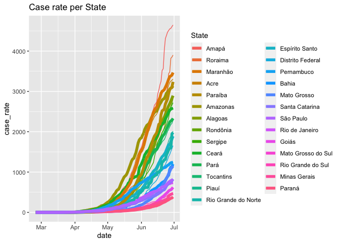<!-- -->

## Death rate: Highlighting the states that show up under I can't smell at any point

```r
trends_df %>% 
  filter(!is.na(state), !is.na(death_rate)) %>% 
  count(death_rate, date, state) %>% 
  ggplot() +
  geom_line(aes(date, death_rate, group = state, color = fct_reorder2(state, date, death_rate))) +
  geom_line(
    data = . %>% filter(state %in% states_cant_smell),
    aes(date, death_rate, group = state, color = fct_reorder2(state, date, death_rate)), size = 2) +
  labs(
    title = "Death rate per State",
    color = "State"
  )
```

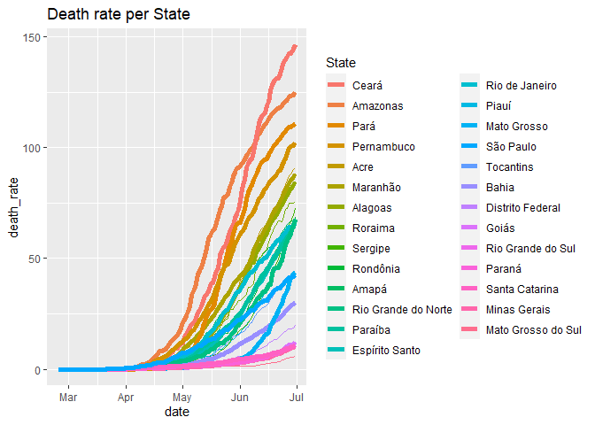<!-- -->

## Cases: Highlighting the states that show up under I can’t smell at any point

```r
trends_df %>% 
  filter(!is.na(state), !is.na(cases)) %>% 
  count(cases, date, state) %>% 
  ggplot() +
  geom_line(aes(date, cases, group = state, color = fct_reorder2(state, date, cases))) +
  geom_line(
    data = . %>% filter(state %in% states_cant_smell),
    aes(date, cases, group = state, color = fct_reorder2(state, date, cases)), size = 2) +
  labs(
    title = "Cases per State",
    color = "State"
  )
```

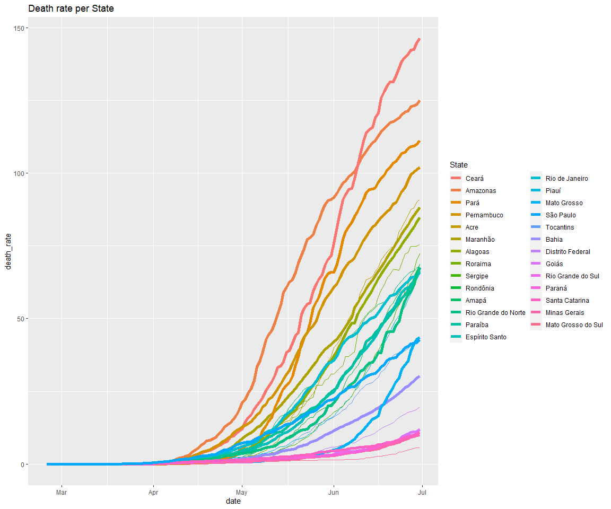<!-- -->


## Date of showing up "I can't smell" 


```r
trends_df %>% 
  filter(!is.na(state), !is.na(death_rate), state %in% states_cant_smell) %>% 
  count(death_rate, date, state) %>% 
  ggplot() +
  geom_line(aes(date, death_rate, group = state, color = fct_reorder2(state, date, death_rate))) +
  geom_vline(
    data = states_cant_smell_date, 
    aes(xintercept = first_date_cant_smell, group = state, color = state)
  ) +
  geom_label_repel(
    data = states_cant_smell_date, 
    aes(first_date_cant_smell, y = 80, label = state), 
    hjust=0.5, vjust=0.4
  ) + 
  labs(
    title = "Death rate per State",
    color = "State"
  )
```

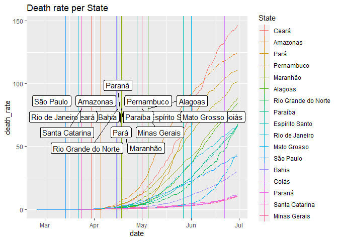<!-- -->


## Graph of current death distinguishing by date of I can’t smell


```r
trends_df %>% 
  left_join(states_cant_smell_date, by = "state") %>% 
  mutate(cant_smell_appears = if_else(!is.na(first_date_cant_smell), 1L, 0L) %>% as.character()) %>% 
  filter(date == "2020-06-28", !is.na(deaths)) %>% 
  count(deaths, state, cant_smell_appears, first_date_cant_smell) %>% 
  arrange(desc(deaths)) %>% 
  ggplot()+ 
  geom_col(aes(fct_reorder(state, deaths), deaths, fill = cant_smell_appears)) +
  geom_label_repel(
    aes(
      x = as.character(state), 
      y = deaths, 
      label = as.character(first_date_cant_smell)
    ), 
    position = position_fill(vjust = 0)
  ) + 
  labs(
    color = "State category"
  ) + 
  coord_flip() + 
  labs(
    title = "States ordered by deaths on June 28th, 2020", 
    x = "State", 
    y = "Deaths"
  )
```

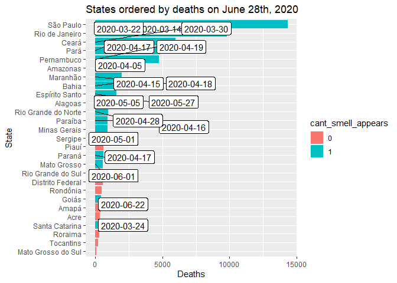<!-- -->

## Looking at cases


```r
trends_df %>% 
  left_join(states_cant_smell_date, by = "state") %>% 
  mutate(
    cant_smell_appears = if_else(!is.na(first_date_cant_smell), 1L, 0L) %>% as.character()
  ) %>% 
  filter(date == "2020-06-28", !is.na(cases)) %>% 
  count(cases, state, cant_smell_appears, first_date_cant_smell) %>% 
  arrange(desc(cases)) %>% 
  ggplot()+ 
  geom_col(aes(fct_reorder(state, cases), cases, fill = cant_smell_appears)) +
  geom_label_repel(
    aes(
      x = as.character(state), 
      y = cases, 
      label = as.character(first_date_cant_smell)
    ), 
    position = position_fill(vjust = 0)
  ) + 
  labs(
    color = "State category"
  ) + 
  coord_flip() + 
  labs(
    title = "States ordered by cases on June 28th, 2020", 
    x = "State", 
    y = "Cases"
  )
```

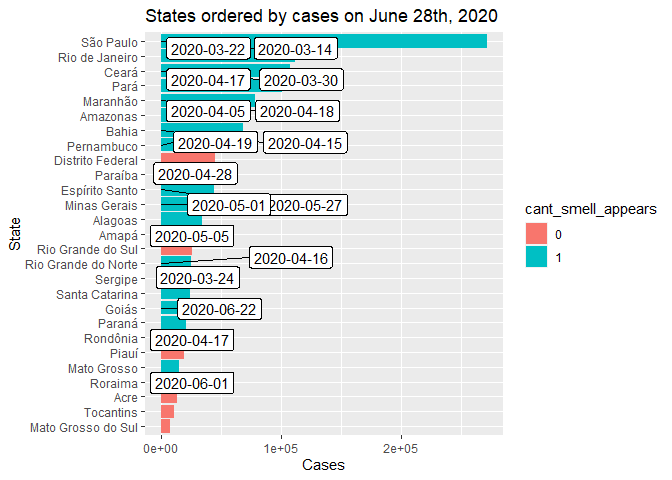<!-- -->
## Looking at death rate


```r
trends_df %>% 
  left_join(states_cant_smell_date, by = "state") %>% 
  mutate(cant_smell_appears = if_else(!is.na(first_date_cant_smell), 1L, 0L) %>% as.character()) %>% 
  filter(date == "2020-06-18", !is.na(death_rate)) %>% 
  count(death_rate, state, cant_smell_appears, first_date_cant_smell) %>% 
  arrange(desc(death_rate)) %>% 
  ggplot()+ 
  geom_col(aes(fct_reorder(state, death_rate), death_rate, fill = cant_smell_appears)) +
  geom_label_repel(
    aes(
      x = as.character(state), 
      y = death_rate, 
      label = as.character(first_date_cant_smell)
    ),  
    position = position_fill(vjust = 0.5)
  ) + 
  coord_flip() + 
  labs(
    title = "States ordered by death rate on June 18th, 2020", 
    x = "State", 
    y = "Deaths per 100,000 people"
  )
```

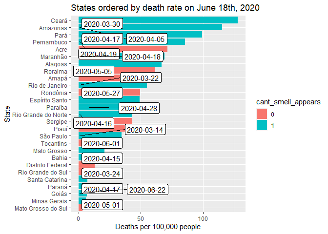<!-- -->


# Event study: weeks since I can't smell
We create a variable for the maximum number of days in a week with "I can't smell" 
- calculate number of times I can't smell is positive for each state in a week
- then count, at the week level, the number of times of I cant smell per state
- then evaluate the growth rate in cases the next week


```r
week_geo <- 
  trends_df %>% 
  filter(keyword == "febre") %>% 
  group_by(week_number, geo) %>% 
  summarize(
    week_days = n(), 
    mean_cases = mean(cases, na.rm = TRUE), 
    mean_deaths = mean(deaths, na.rm = TRUE), 
    mean_case_rate = mean(case_rate, na.rm = TRUE), 
    mean_death_rate = mean(death_rate, na.rm = TRUE), 
    mean_fatalities_per_case = mean(fatalities_per_case, na.rm = TRUE), 
    mean_growth_rate_cases = mean(growth_rate_cases, na.rm = TRUE), 
    mean_growth_rate_deaths = mean(growth_rate_deaths, na.rm = TRUE)
  ) %>% 
  ungroup()


week_geo_cant_smell <- 
  trends_df %>% 
  filter(keyword == "perdi o olfato", week_number >= 8) %>% 
  group_by(week_number, geo) %>% 
  filter(hits_adj > 0) %>% 
  summarize(
    days_cant_smell = n()
  ) %>% 
  ungroup()

week_df <- 
  week_geo %>% 
  left_join(week_geo_cant_smell, by = c("week_number", "geo"))

week_df <- 
  week_df %>% 
  mutate(rate_cant_smell = days_cant_smell/week_days)
```

I keep the weeks when "I can't smell" is the maximum for each state 

```r
#selecting number of days cant smell appears per week at the state level
max_week_cant_smell <- 
  week_df %>% 
  filter(week_number > 8) %>% 
  group_by(geo) %>% 
  count(days_cant_smell, week_number) %>% 
  arrange(desc(days_cant_smell)) %>% ungroup()

#keeping only the maximum number of days in a week (might be multiple weeks if there is a tie)
max_week_cant_smell <- 
  max_week_cant_smell %>% 
  group_by(geo) %>% 
  top_n(1, days_cant_smell)

#if there is a tie in maximum number of days of I cant smell, we pick the earlier week
max_week_cant_smell <- 
  max_week_cant_smell %>% 
  group_by(geo) %>% 
  top_n(-1, week_number)

#we rename the variables to merge them with the rest of the data
max_week_cant_smell <-   
  max_week_cant_smell %>% 
  rename(max_days_cant_smell = days_cant_smell, week_max_days = week_number) %>% dplyr::select(-n)

week_df <- 
  week_df %>% 
  left_join(max_week_cant_smell, by = c("geo"))
```

We now do an event study of the cases in weeks before and after the maximum days of "I can't smell"


```r
week_df <- 
  week_df %>% 
  group_by(geo) %>% 
  mutate(
    weeks_since_max_cant_smell = week_number - week_max_days
  )
```

We now plot the relationship with a few different outcomes

## Event study: cases and deaths

We do it with the mean of cases and deaths

```r
week_df %>% 
  filter(!is.na(weeks_since_max_cant_smell)) %>%
  group_by(weeks_since_max_cant_smell) %>% 
  summarize(
    mean_cases = mean(mean_cases, na.rm = TRUE), 
    mean_deaths = mean(mean_deaths, na.rm = TRUE)
  ) %>% 
  ggplot() +
  geom_line(aes(weeks_since_max_cant_smell, mean_cases, color = "Mean cases")) + 
  geom_line(aes(weeks_since_max_cant_smell, mean_deaths, color = "Mean deaths")) +
  geom_vline(aes(xintercept = 0), linetype = "dashed") +
  geom_text(
    aes(
      x = 0, 
      y = 80000, 
      label = "Week with the most \nI can't smell"
    ), 
    size = 3
    ) +
  labs(
    title = "Average evolution of states relative to the week \nwith the most I can't smell appearances",
    x = "Weeks since maximum I can't smell appearances", 
    y = "Mean cases or deaths per state", 
    color = "Variable"
  ) +
  theme_light() + 
  coord_cartesian(xlim = c(-10, 8))
```

<!-- -->

## Event study: case and death rate

We do it with the mean of case rate and death rate

```r
week_df %>% 
  filter(!is.na(weeks_since_max_cant_smell)) %>%
  group_by(weeks_since_max_cant_smell) %>% 
  summarize(
    mean_case_rate = mean(mean_case_rate, na.rm = TRUE), 
    mean_death_rate = mean(mean_death_rate, na.rm = TRUE)
  ) %>% 
  ggplot() +
  geom_line(aes(weeks_since_max_cant_smell, mean_case_rate, color = "Mean case rate")) + 
  geom_line(aes(weeks_since_max_cant_smell, mean_death_rate, color = "Mean death rate"))  +
  geom_vline(aes(xintercept = 0), linetype = "dashed") +
  labs(
    x = "Weeks since maximum I can't smell", 
    y = "Mean case or death rate", 
    color = "Variable"
  ) + 
  theme_light()
```

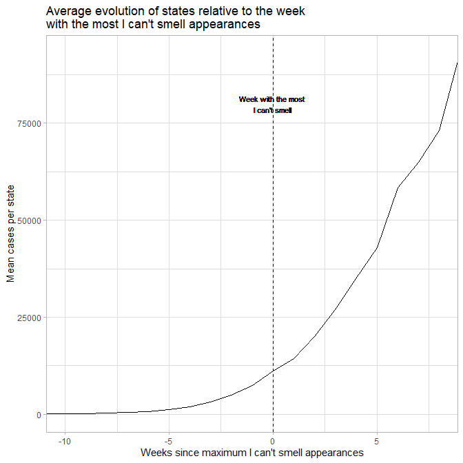<!-- -->

## Event study: growth rate of cases and deaths

We do it with the mean growth rate of cases and deaths


```r
week_df %>% 
  filter(!is.na(weeks_since_max_cant_smell)) %>%
  group_by(weeks_since_max_cant_smell) %>% 
  summarize(
    mean_growth_rate_cases = mean(mean_growth_rate_cases, na.rm = TRUE), 
    mean_growth_rate_deaths = mean(mean_growth_rate_deaths, na.rm = TRUE)
  ) %>% 
  ggplot() +
  geom_line(aes(weeks_since_max_cant_smell, mean_growth_rate_cases, color = "Mean growth rate of cases")) + 
  geom_line(aes(weeks_since_max_cant_smell, mean_growth_rate_deaths, color = "Mean growth rate of deaths"))  +
  geom_vline(aes(xintercept = 0), linetype = "dashed") + 
  labs(
    x = "Weeks since maximum I can't smell", 
    y = "Mean growth rate of cases or deaths", 
    color = "Variable"
  )
```

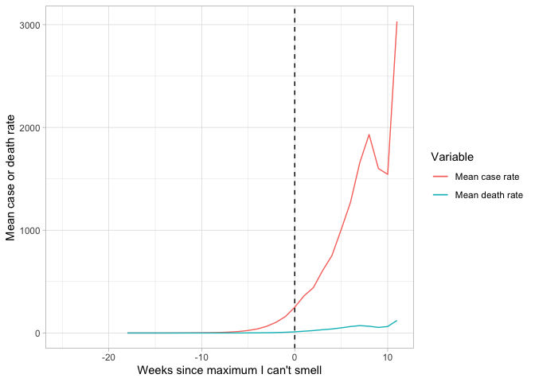<!-- -->

## Event study at the state level with mean cases or deaths

We now do the graphs at the state level

```r
week_df %>% 
  filter(!is.na(weeks_since_max_cant_smell)) %>%
  group_by(weeks_since_max_cant_smell, geo) %>% 
  summarize(
    mean_cases = mean(mean_cases, na.rm = TRUE), 
    mean_deaths = mean(mean_deaths, na.rm = TRUE)
  ) %>% 
  ggplot() +
  geom_line(aes(weeks_since_max_cant_smell, mean_cases, color = "Mean cases")) + 
  geom_line(aes(weeks_since_max_cant_smell, mean_deaths, color = "Mean deaths")) + 
  geom_vline(aes(xintercept = 0), linetype = "dashed") +
  facet_wrap(vars(geo)) + 
  labs(
    x = "Weeks since maximum days of I can't smell", 
    y = "Mean cases or deaths", 
    color = "Variable"
  ) + 
  coord_cartesian(xlim = c(-10, 10)) + 
  theme_light()
```

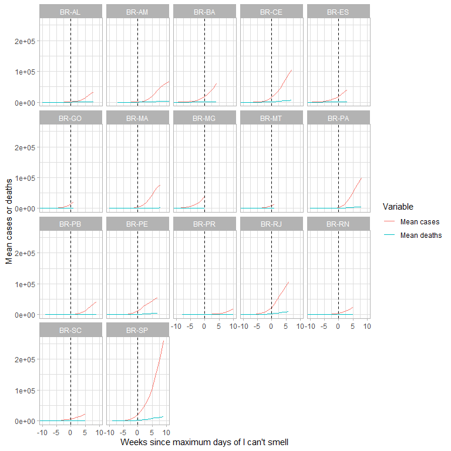<!-- -->

## Does the intensity in the number of days matters?

We adjust the size of the line to take into account the number of days in the week that I can't smell appears in the key week for each state


```r
week_df %>% 
  filter(!is.na(weeks_since_max_cant_smell)) %>%
  group_by(weeks_since_max_cant_smell, geo) %>% 
  summarize(
    mean_cases = mean(mean_cases, na.rm = TRUE), 
    mean_deaths = mean(mean_deaths, na.rm = TRUE), 
    mean_max_days_cant_smell = mean(max_days_cant_smell, na.rm = TRUE)
  ) %>% 
  ggplot() +
  geom_line(
    aes(
      weeks_since_max_cant_smell, 
      mean_cases, 
      color = "Mean cases", 
      size = mean_max_days_cant_smell/2)
  ) + 
  geom_line(
    aes(
      weeks_since_max_cant_smell, 
      mean_deaths, 
      color = "Mean deaths", 
      size = mean_max_days_cant_smell/2)
  ) + 
  geom_vline(aes(xintercept = 0), linetype = "dashed") +
  facet_wrap(vars(geo)) + 
  labs(
    x = "Weeks since maximum days of I can't smell", 
    y = "Mean cases or deaths", 
    color = "Variable", 
    size = "Intensity in # days with I can't smell (x2)"
  ) + 
  coord_cartesian(xlim = c(-10, 10))
```

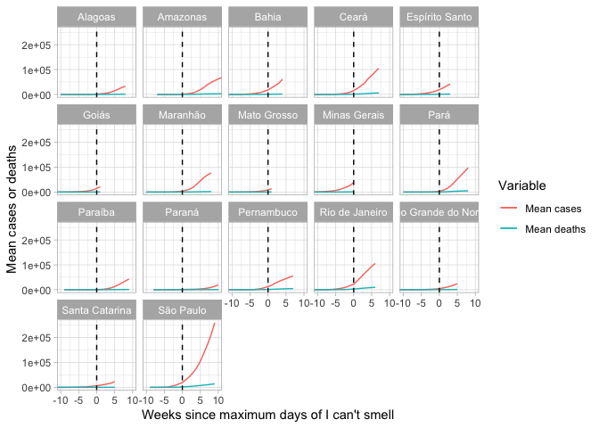<!-- -->


## Showing the actual dates instead

We now do the graphs at the state level and show the actual dates instead

```r
week_df %>% 
  group_by(week_number, geo) %>% 
  summarize(
    mean_cases = mean(mean_cases, na.rm = TRUE), 
    mean_deaths = mean(mean_deaths, na.rm = TRUE), 
    week_max_days = mean(week_max_days, na.rm = TRUE)
  ) %>% 
  ggplot() +
  geom_line(aes(week_number, mean_cases, color = "Mean cases")) + 
  geom_line(aes(week_number, mean_deaths, color = "Mean deaths")) + 
  geom_vline(aes(xintercept = week_max_days), linetype = "dashed") +
  facet_wrap(vars(geo)) + 
  labs(
    x = "Weeks since maximum days of I can't smell", 
    y = "Mean cases or deaths", 
    color = "Variable"
  ) +
  theme_light()
```

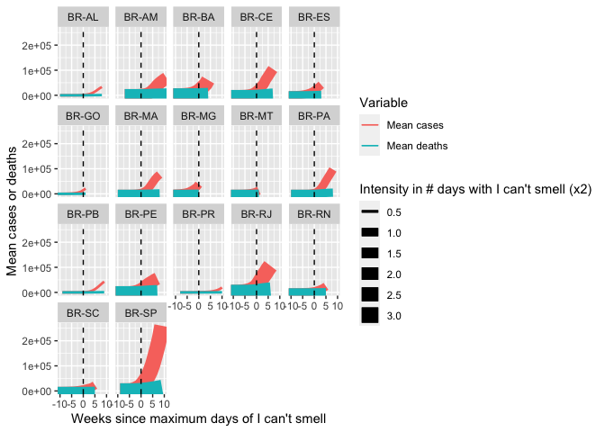<!-- -->


```r
week_df %>% 
  count(geo, max_days_cant_smell)
```

```
## # A tibble: 27 x 3
## # Groups:   geo [27]
##    geo   max_days_cant_smell     n
##    <chr>               <int> <int>
##  1 BR-AC                  NA    26
##  2 BR-AL                   1    26
##  3 BR-AM                   4    26
##  4 BR-AP                  NA    26
##  5 BR-BA                   5    26
##  6 BR-CE                   3    26
##  7 BR-DF                  NA    26
##  8 BR-ES                   2    26
##  9 BR-GO                   1    26
## 10 BR-MA                   2    26
## # ... with 17 more rows
```


## Correlations between I can't smell and covid cases

Create the variables counting the number of days before/after "I can't smell" shows up. For those states that don't have "I can't smell", we won't be able to include them. 

```r
#trends_df <- 
#  trends_df %>% 
#  left_join(states_cant_smell_date, by = "state") %>% 
#  mutate(
#    days_from_cant_smell = date - first_date_cant_smell
#  ) 
```

We replicate the table of correlations from day -3 to day 3 for each state

```r
#ex_df <- 
#  trends_df %>% 
#  filter(days_from_cant_smell >= -3, days_from_cant_smell <= 3) %>% 
#  mutate(days_from_cant_smell = as.numeric(days_from_cant_smell))

#cor(ex_df$days_from_cant_smell, ex_df$hits_adj, use = "complete.obs")

#cor(ex_df$days_from_cant_smell, ex_df$hits_adj, use = "complete.obs")
```


```r
# data <- 
#   gather(
#     data_all, city, pr, Bilbao:Valencia) %>%
#     gather(telecon, index, NAO:AO
#   )
# 
# data
# 
# data_nest <- group_by(data, city, telecon) %>% nest()
# data_nest
# 
# str(slice(data_nest, 1))
# 
# cor_fun <- function(df) cor.test(df$pr, df$index, method = "spearman") %>% tidy()
# 
# data_nest <- mutate(data_nest, model = map(data, cor_fun))
# data_nest
# 
# str(slice(data_nest, 1))
# 
# corr_pr <- select(data_nest, -data) %>% unnest()
# corr_pr
# 
# corr_pr <- mutate(corr_pr, sig = ifelse(p.value <0.05, "Sig.", "Non Sig."))
# 
# ggplot()+
#   geom_tile(data = corr_pr,
#             aes(city, telecon, fill = estimate),
#             size = 1,
#             colour = "white")+
#   geom_tile(data = filter(corr_pr, sig == "Sig."),
#             aes(city, telecon),
#             size = 1,
#             colour = "black",
#             fill = "transparent")+
#   geom_text(data = corr_pr,
#             aes(city, telecon, label = round(estimate, 2),
#             fontface = ifelse(sig == "Sig.", "bold", "plain")))+
#   scale_fill_gradient2(breaks = seq(-1, 1, 0.2))+
#   labs(x = "", y = "", fill = "", p.value = "")+
#   theme_minimal()+
#   theme(panel.grid.major = element_blank(),
#         panel.border = element_blank(),
#         panel.background = element_blank(),
#         axis.ticks = element_blank())
```
