```r
trends_df <- trends_df %>% mutate(date = as.Date(date))
trends_df <- 
  trends_df %>% 
  filter(!is.na(date))
```

# Google Trends Overall

Evolution of symptoms and virus searches


```r
symptoms <- 
  trends_df %>% 
  filter(!is.na(state), !is.na(keyword), categories %in% c("symptoms", "virus"), !is.na(hits)) %>% 
  group_by(date, keyword) %>% 
  summarize(
    weighted_mean_hits = weighted.mean(hits, w = estimate_2018_state)
  ) %>% 
  ggplot() +
  geom_line(aes(date, weighted_mean_hits)) +
  labs(
    y = "Weighted Average Number of Hits",
    title = "Average Number of Hits by Keyword Over Time (Symptoms)", 
    subtitle = "The average is weighted by the number of people in each state"
  ) +
  facet_wrap(vars(keyword))

symptoms
```

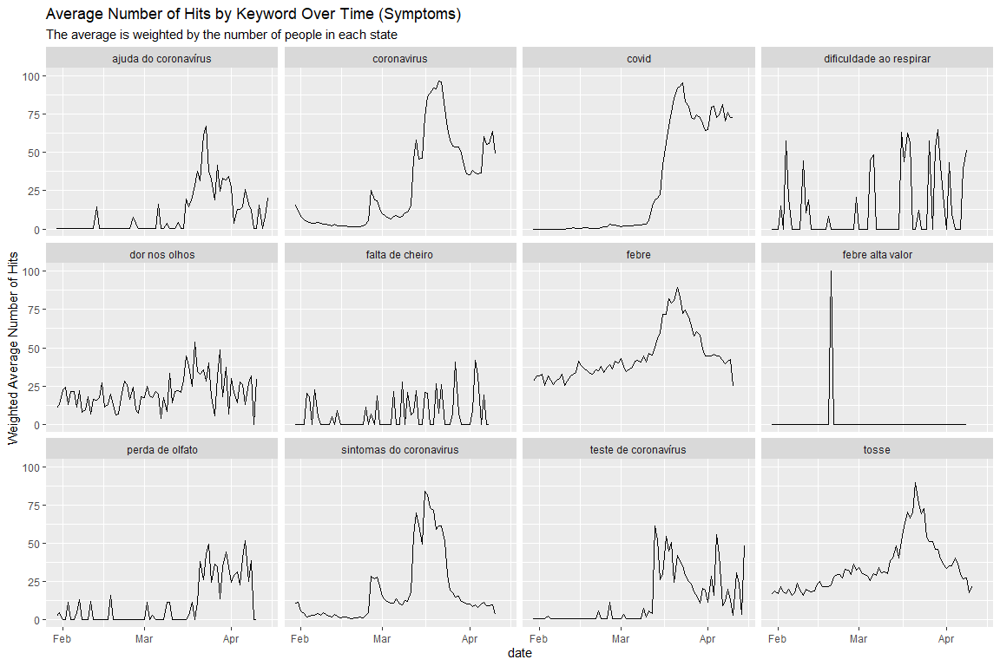<!-- -->

Evolution of prevention


```r
prevention <- 
  trends_df %>% 
  filter(!is.na(state), !is.na(keyword), categories == "prevention", !is.na(hits)) %>% 
  group_by(date, keyword) %>% 
  summarize(
    weighted_mean_hits = weighted.mean(hits, w = estimate_2018_state)
  ) %>% 
  ggplot() +
  geom_line(aes(date, weighted_mean_hits)) +
  labs(
    y = "Weighted Average Number of Hits",
    title = "Average Number of Hits by Keyword Over Time (Prevention)", 
    subtitle = "The average is weighted by the number of people in each state"
  ) +
  facet_wrap(vars(keyword))

prevention
```

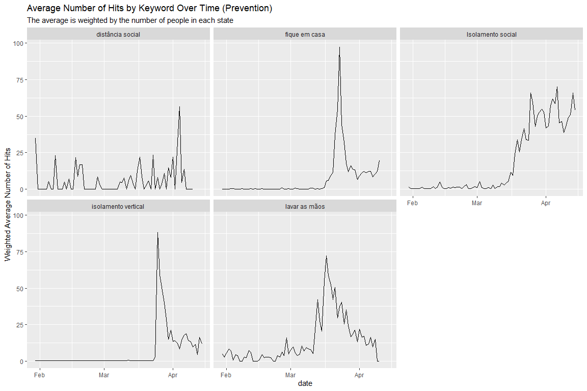<!-- -->

Evolution of Resources


```r
resources <- 
  trends_df %>% 
  filter(!is.na(state), !is.na(keyword), categories == "resources", !is.na(hits)) %>% 
  group_by(date, keyword) %>% 
  summarize(
    weighted_mean_hits = weighted.mean(hits, w = estimate_2018_state)
  ) %>% 
  ggplot() +
  geom_line(aes(date, weighted_mean_hits)) +
  labs(
    y = "Weighted Average Number of Hits",
    title = "Weighted Average Number of Hits by Keyword Over Time (Resources)", 
    subtitle = "The average is weighted by the number of people in each state"
  ) +
  facet_wrap(vars(keyword))

resources
```

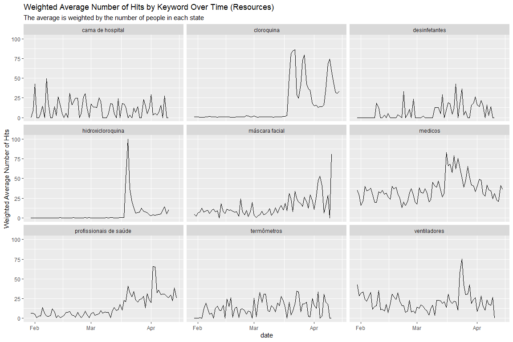<!-- -->

Evolution of consequences


```r
consequences <- 
  trends_df %>% 
  filter(!is.na(state), !is.na(keyword), categories == "consequences", !is.na(hits)) %>% 
  group_by(date, keyword) %>% 
  summarize(
    weighted_mean_hits = weighted.mean(hits, w = estimate_2018_state)
  ) %>% 
  ggplot() +
  geom_line(aes(date, weighted_mean_hits)) +
  labs(
    y = "Weighted Average Number of Hits",
    title = "Average Number of Hits by Keyword Over Time (Consequences)", 
    subtitle = "The average is weighted by the number of people in each state"
  ) +
  facet_wrap(vars(keyword))

consequences
```

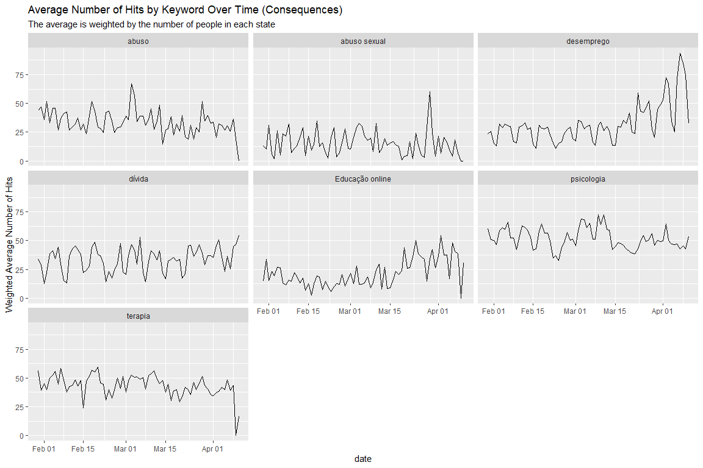<!-- -->

All in one graph

```r
trends_df %>% 
  filter(!is.na(state), !is.na(keyword), !is.na(hits)) %>% 
  group_by(date, keyword) %>% 
  summarize(
    weighted_mean_hits = weighted.mean(hits, w = estimate_2018_state)
  ) %>% 
  ggplot() +
  geom_line(aes(date, weighted_mean_hits)) +
  labs(
    y = "Weighted Average Number of Hits",
    title = "Average Number of Hits by Keyword Over Time (All)", 
    subtitle = "The average is weighted by the number of people in each state"
  ) +
  facet_wrap(vars(keyword))
```

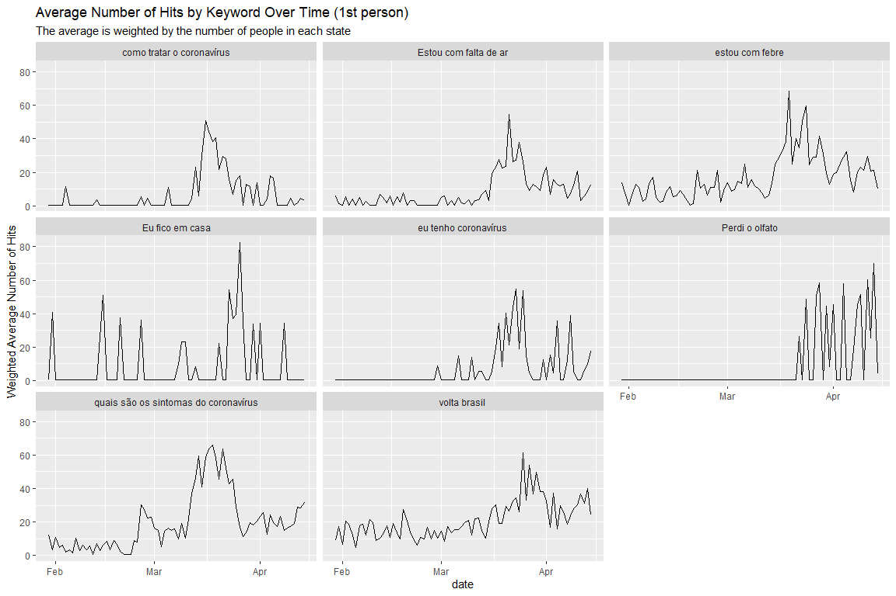<!-- -->

# Covid-19 per state

Total number of cases across states

```r
trends_df %>% 
  filter(!is.na(state), !is.na(cases)) %>% 
  count(cases, date, state) %>% 
  ggplot() +
  geom_line(aes(date, cases, group = state, color = fct_reorder2(state, date, cases))) +
  labs(
    title = "Cases per State",
    color = "State"
  )
```

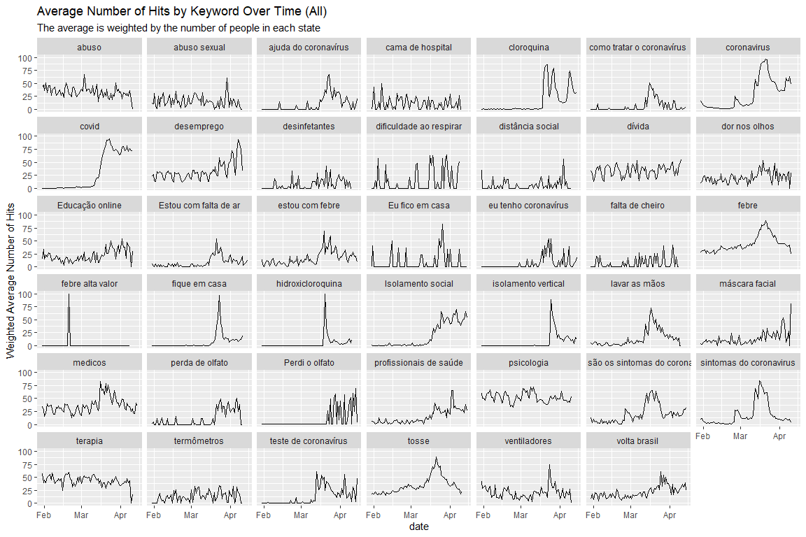<!-- -->

Total number of deaths across states


```r
trends_df %>% 
  filter(!is.na(state), !is.na(cases)) %>% 
  count(deaths, date, state) %>% 
  ggplot() +
  geom_line(aes(date, deaths, group = state, color = fct_reorder2(state, date, deaths))) +
  labs(
    title = "Deaths per State",
    color = "State"
  )
```

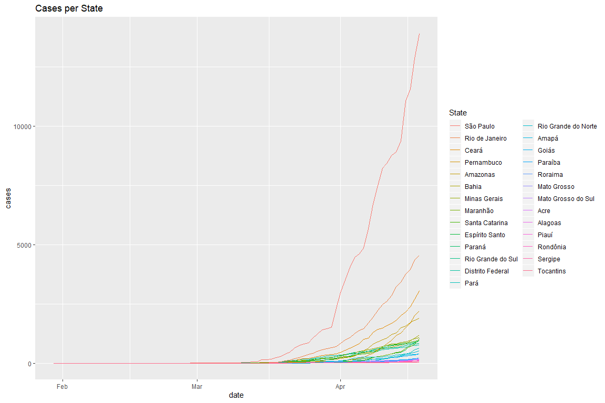<!-- -->

Case rate per state

```r
trends_df %>% 
  filter(!is.na(state), !is.na(case_rate)) %>% 
  count(case_rate, date, state) %>% 
  ggplot() +
  geom_line(aes(date, case_rate, group = state, color = fct_reorder2(state, date, case_rate))) +
  labs(
    title = "Case rate per State",
    color = "State"
  )
```

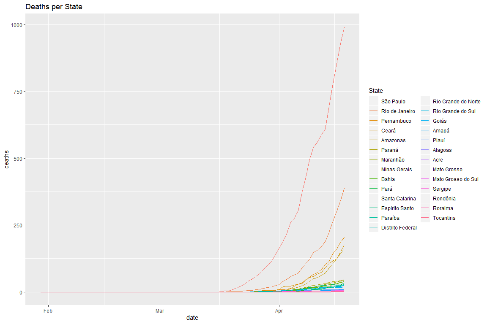<!-- -->

Death rate per state

```r
trends_df %>% 
  filter(!is.na(state), !is.na(death_rate)) %>% 
  count(death_rate, date, state) %>% 
  ggplot() +
  geom_line(aes(date, death_rate, group = state, color = fct_reorder2(state, date, death_rate))) +
  labs(
    title = "Death rate per State",
    color = "State"
  )
```

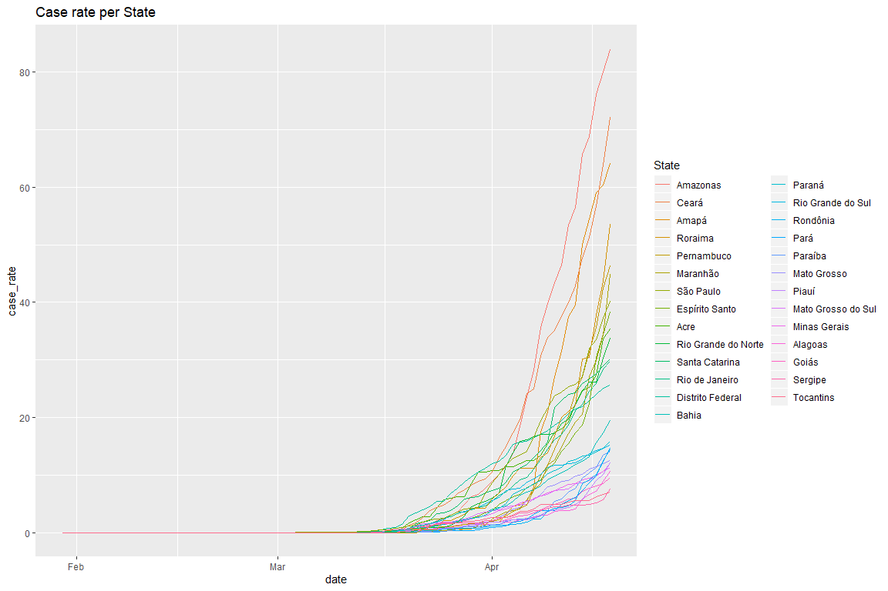<!-- -->


# Cumulative figures of covid-19

At the regional level 

```r
trends_df %>% 
  filter(!is.na(state), !is.na(cases)) %>% 
  group_by(region, date) %>% 
  summarize(
    sum_cases_region = sum(cases, na.rm = TRUE), 
    sum_deaths_region = sum(deaths, na.rm = TRUE)
  ) %>% 
  pivot_longer(c(sum_cases_region, sum_deaths_region), names_to = "variable") %>% 
  ggplot() +
  geom_line(aes(date, value, group = region, color = fct_reorder2(region, date, value))) +
  labs(color = "Region", title = "Cumulative Number of Cases and Deaths per Region") +
  theme(plot.title = element_text(hjust = 0.55)) +
  facet_wrap(vars(variable), scales = "free")
```

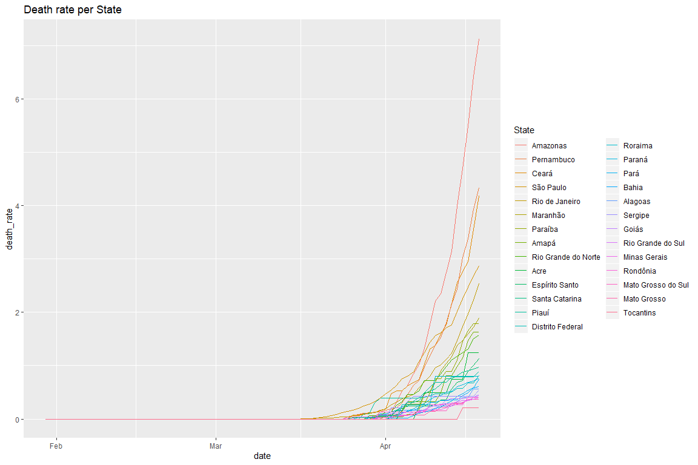<!-- -->

At the state level

```r
trends_df %>% 
  filter(!is.na(state), !is.na(cases)) %>% 
  group_by(state, date) %>% 
  summarize(
    sum_cases_state = sum(cases, na.rm = TRUE), 
    sum_deaths_state = sum(deaths, na.rm = TRUE)
  ) %>% 
  pivot_longer(c(sum_cases_state, sum_deaths_state), names_to = "variable") %>% 
  ggplot() +
  geom_line(aes(date, value, group = state, color = fct_reorder2(state, date, value))) +
  labs(color = "State", title = "Cumulative Number of Cases and Deaths per State") +
  theme(plot.title = element_text(hjust = 0.55)) +
  facet_wrap(vars(variable), scales = "free")
```

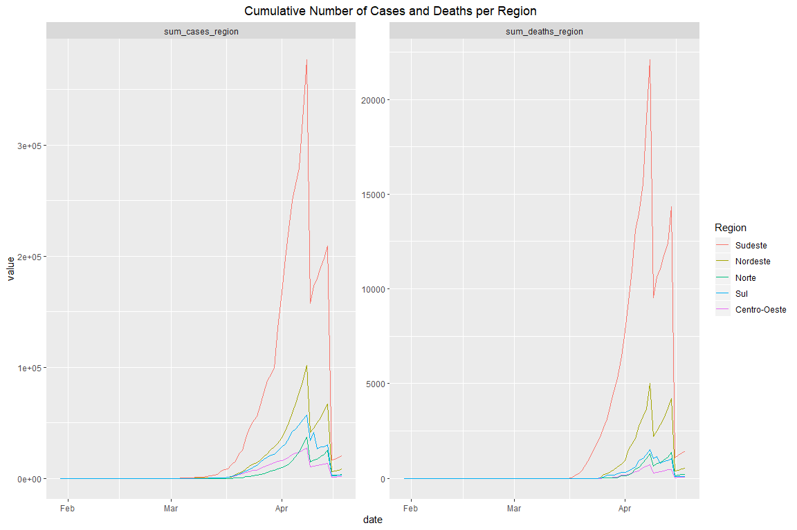<!-- -->

# States ordered by death and case rate on April 1st


```r
case_rate_per_state <- 
  trends_df %>% 
  filter(date == "2020-04-01", is.na(keyword) | keyword == "coronavirus") %>% 
  ggplot() +
  geom_col(aes(fct_reorder(state, case_rate), case_rate)) +
  coord_flip() +
  labs(x = "Cases per 100,000 people")

death_rate_per_state <- 
  trends_df %>% 
  filter(date == "2020-04-01", is.na(keyword) | keyword == "coronavirus") %>% 
  ggplot() +
  geom_col(aes(fct_reorder(state, death_rate), death_rate)) +
  coord_flip() +
  labs(x = "Deaths per 100,000 people")


fatality_per_case_state <- 
  trends_df %>% 
  filter(date == "2020-04-01", is.na(keyword) | keyword == "coronavirus") %>% 
  ggplot() +
  geom_col(aes(fct_reorder(state, fatalities_per_case), fatalities_per_case)) +
  coord_flip() + 
  labs(x = "Deaths per case")
  
grid.arrange(case_rate_per_state, death_rate_per_state, fatality_per_case_state, ncol = 3)
```

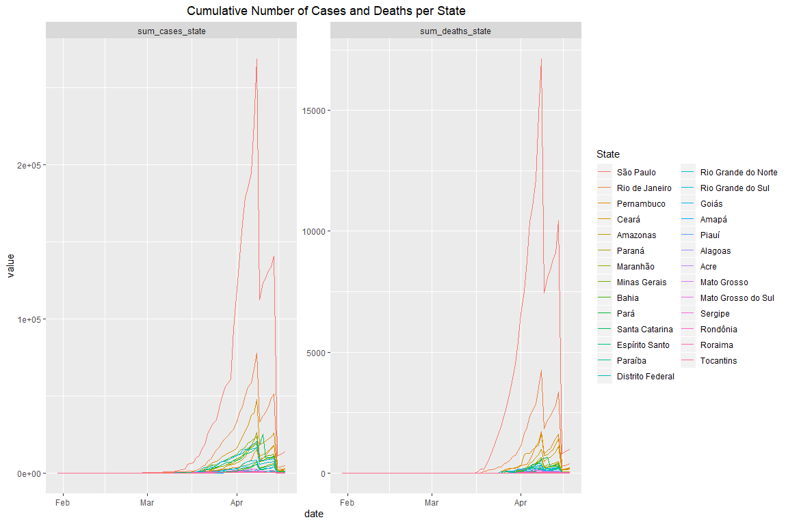<!-- -->


```r
top_5_case_rate <- 
  trends_df %>% 
  filter(date == "2020-04-01", is.na(keyword) | keyword == "coronavirus") %>% 
  arrange(desc(case_rate)) %>% 
  head(5) %>% pull(state)

top_5_death_rate <- 
  trends_df %>% 
  filter(date == "2020-04-01", is.na(keyword) | keyword == "coronavirus") %>% 
  arrange(desc(death_rate)) %>% 
  head(5) %>% pull(state)
```


# We focus on top 5 states in number of cases


```r
top_5_states <- 
  trends_df %>% 
  group_by(state) %>% 
  summarize(sum_cases = sum(cases, na.rm = TRUE)) %>% 
  arrange(desc(sum_cases)) %>% 
  head(5) %>% 
  mutate(state = as.character(state)) %>%
  pull(state)
```

Just checking the hits per keyword across states

```r
trends_df %>% 
  filter(state %in% top_5_states) %>% 
  count(keyword, date, hits, state) %>% 
  ggplot() +
  geom_line(aes(date, hits, group = state, color = state)) + 
  facet_wrap(vars(keyword))
```

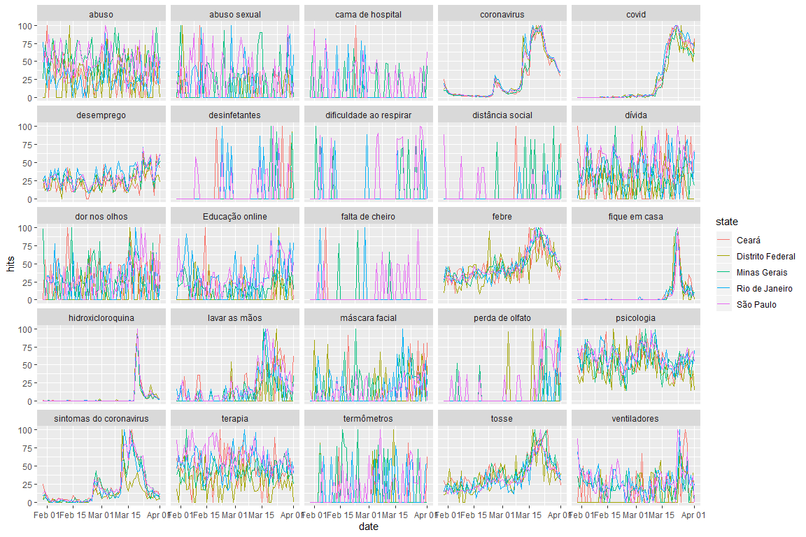<!-- -->

We now change the focus to the state level, and see the correlations of each keyword with the number of cases


Selected keywords


```r
trends_df %>% 
  filter(state %in% top_5_states, keyword %in% c("coronavirus", "febre", "tosse", "fique em casa") ) %>% 
  count(keyword, date, hits, state, cases) %>% 
  ggplot() +
  geom_line(aes(date, hits, group = keyword, color = fct_reorder2(keyword, date, hits))) + 
  geom_line(aes(date, cases, color = "covid-19 cases"), fill = "black", size = 1.5) +
  labs(color = "Keyword") +
  facet_wrap(vars(state), scales = "free") +
  coord_cartesian(ylim = c(0, 100))
```

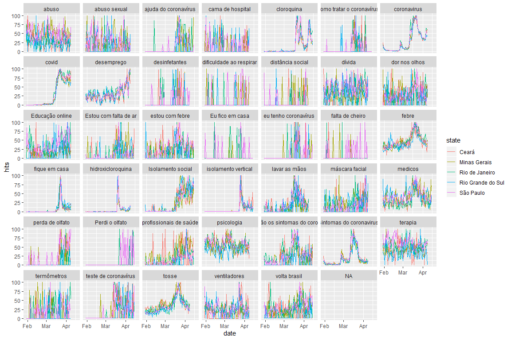<!-- -->

- "fique em cassa" (stay at home) becomes popular after the increase in cases of coronavirus takes place.
- in contrast, the increase in popularity of "coronavirus", "tosse" and "febre" precedes the increase in actual cases. 


# Comparison between Google Trends and Presence of Covid-19

We group by category, then evaluate the time lag between the average of the category and the case rate


```r
sum_cases_date <- 
  trends_df %>% 
  filter(!is.na(state), !is.na(cases), is.na(keyword) | keyword == "coronavirus") %>% 
  group_by(date) %>% 
  summarize(
    cases_total = sum(cases, na.rm = TRUE), 
    cases_mean = mean(cases, na.rm = TRUE), 
    deaths_total = sum(deaths, na.rm = TRUE), 
    deaths_mean = mean(deaths, na.rm = TRUE), 
  )

trends_df %>% 
  filter(!is.na(categories)) %>% 
  mutate(date = as.Date(date, format = "%Y%m%d")) %>% 
  group_by(categories, date) %>% 
  summarize(
    mean_hits = mean(hits, na.rm = TRUE)
  ) %>% 
  ggplot() + 
  geom_line(aes(date, mean_hits, group = categories, color = fct_reorder2(categories, date, mean_hits))) +
  geom_line(data = sum_cases_date, aes(date, cases_mean)) +
  #geom_line(data = sum_cases_date, aes(date, deaths_mean)) +
  ggplot2::annotate("text", label = "Average Cases", x = as.Date("2020-03-24"), y = 100, size = 4) +
  #ggplot2::annotate("text", label = "Average Deaths", x = as.Date("2020-03-29"), y = 2, size = 4) +
  labs(color = "Category", y = "Average hits in Google trends") +
  coord_cartesian(ylim = c(0, 100)) +
  theme_light()
```

<!-- -->

We now look into each of the states

```r
trends_df %>% 
  filter(!is.na(categories), state %in% top_5_case_rate, categories != "consequences") %>% 
  group_by(categories, state, date) %>% 
  mutate(
    mean_hits = mean(hits, na.rm = TRUE)
  ) %>% 
  ggplot() + 
  geom_line(aes(date, mean_hits, group = categories, color = fct_reorder2(categories, date, mean_hits))) +
  geom_line(aes(date, cases)) +
  labs(color = "Category", caption = "The black line refers to number of cases") +
  coord_cartesian(ylim = c(0, 100)) + 
  facet_wrap(vars(state)) 
```

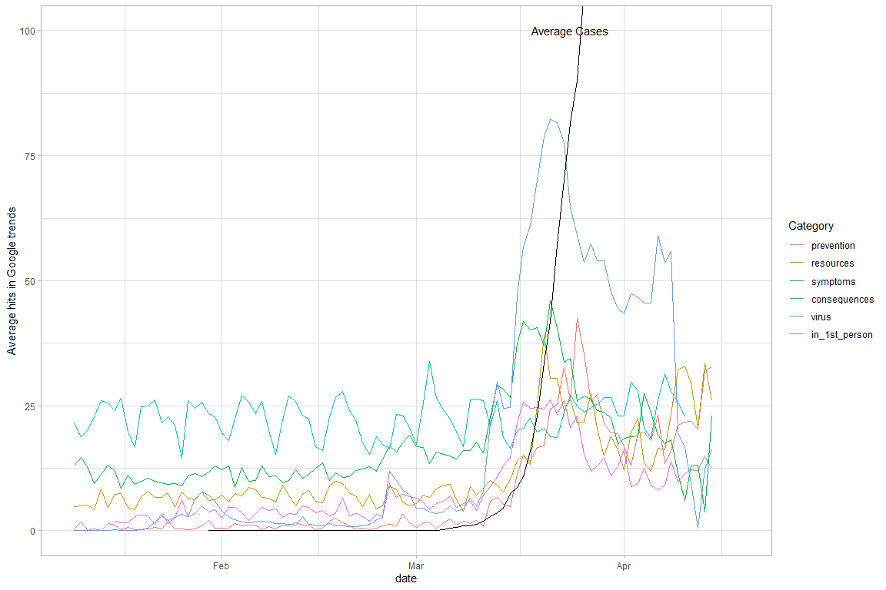<!-- -->


```r
trends_df %>% 
  filter(!is.na(categories), state %in% top_5_case_rate, categories != "consequences") %>% 
  group_by(categories, state, date) %>% 
  mutate(
    mean_hits = mean(hits, na.rm = TRUE)
  ) %>% 
  ggplot() + 
  geom_line(aes(date, mean_hits, group = categories, color = fct_reorder2(categories, date, mean_hits))) +
  geom_line(aes(date, cases)) +
  labs(color = "Category", caption = "The black line refers to number of cases") +
  coord_cartesian(ylim = c(0, 100)) + 
  facet_wrap(vars(state)) +
  theme_light()
```

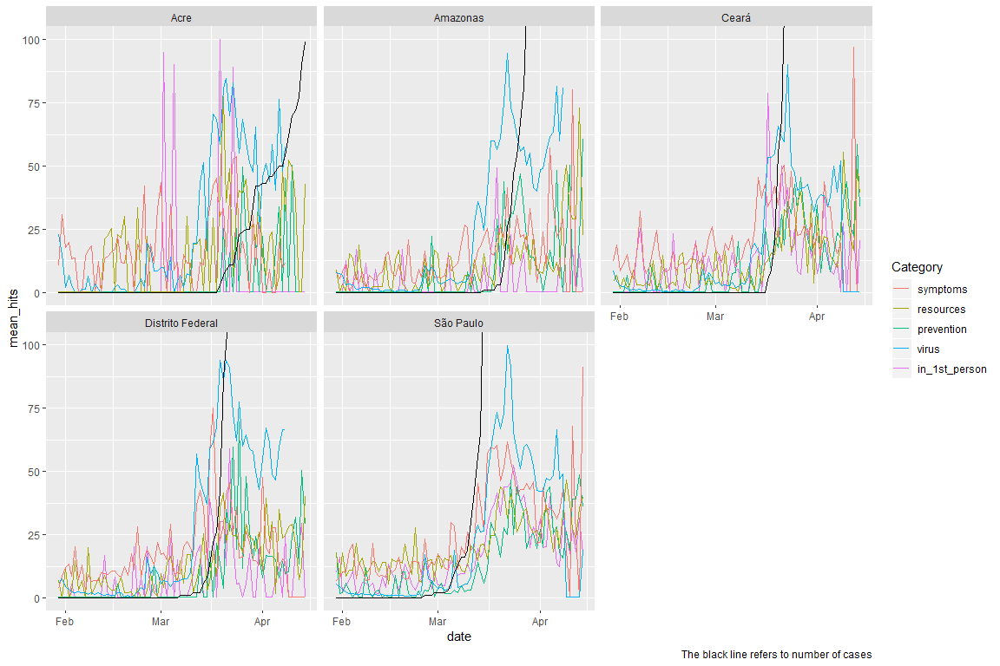<!-- -->

- people start to google about the virus and about symptoms around the time when the number of cases in Sao Paulo starts to increase. 


```r
trends_df %>% 
  filter(!is.na(categories), categories != "consequences", !is.na(state)) %>% 
  group_by(categories, state, date) %>% 
  mutate(
    mean_hits = mean(hits, na.rm = TRUE)
  ) %>% 
  ggplot() + 
  geom_line(aes(date, mean_hits, group = categories, color = fct_reorder2(categories, date, mean_hits))) +
  geom_line(aes(date, cases)) +
  labs(color = "Category") +
  coord_cartesian(ylim = c(0, 100)) + 
  facet_wrap(vars(state))
```

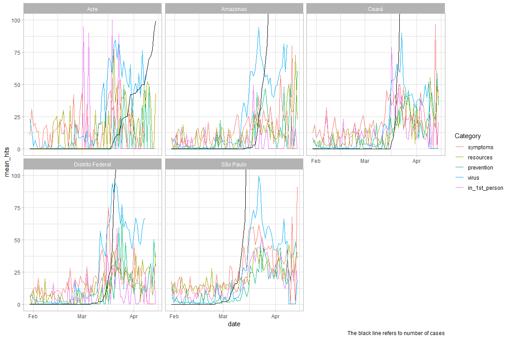<!-- -->
