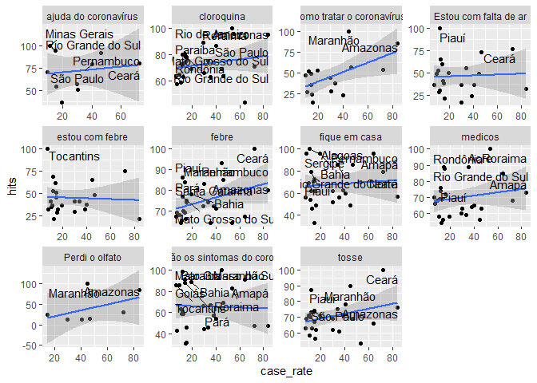
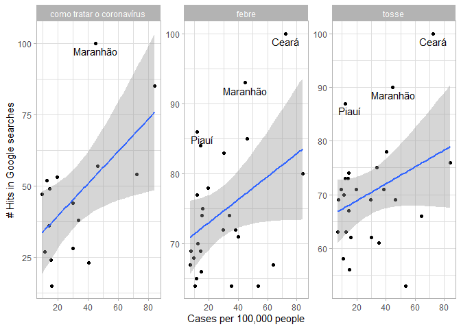
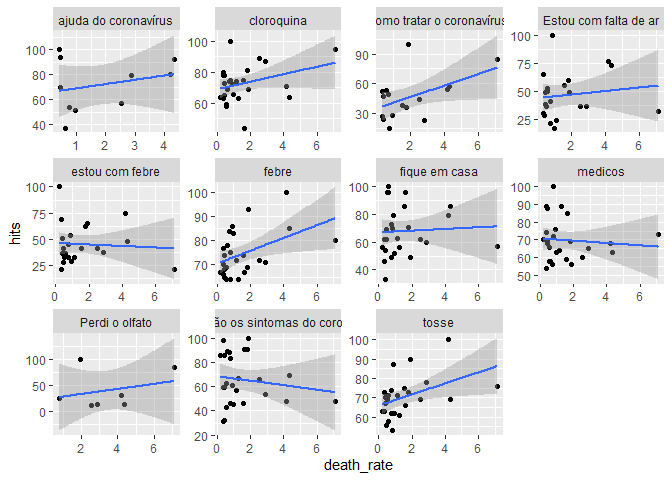
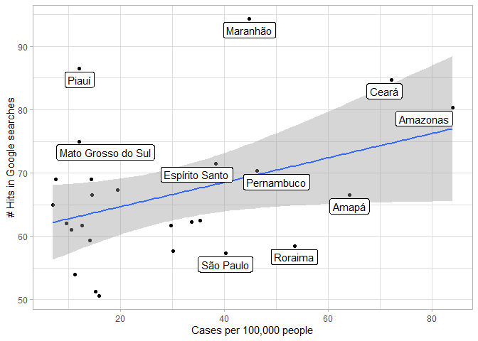

```r
library(tidyverse)
library(gridExtra)
library(lubridate)
library(ggrepel)

if(Sys.info()[["user"]] == "wb537287") dropbox_file_path <- "/Users/wb537287/Dropbox/COVID Social Media Analysis"

states_df <- read.csv(file.path(dropbox_file_path, "Data/google_trends/FinalData/brazil_crosstates_clean.csv"))
```

We focus on the latest date of cases that we have, April 18. The trends data was extracted in April 20, so this is close enough. 


```r
states_df_0418 <- 
  states_df %>% 
  filter(date == "2020-04-18") 

selected_keywords <- 
  c("ajuda do coronavírus", "cloroquina", "como tratar o coronavírus", 
    "coronavirus", "covid", 
    "Estou com falta de ar", "estou com febre", "febre", 
    "fique em casa", "medicos", "quais são os sintomas do coronavírus", 
    "sintomas do coronavirus", "tosse")
```


# Correlation between keywords and case rate


```r
states_df_0418 %>%
  filter(!is.na(hits), keyword %in% selected_keywords) %>% 
  ggplot() + 
  geom_point(aes(case_rate, hits)) +
  geom_smooth(aes(case_rate, hits), method = "lm") +
  geom_text_repel(
    data = . %>% filter(hits > 75), 
    aes(case_rate, hits, label = state), 
    hjust=0.5, vjust=0.4
  ) +  
  facet_wrap(vars(keyword), scales = "free")
```

<!-- -->

## Only for main words


```r
states_df_0418 %>%
  filter(!is.na(hits), keyword %in% c("febre", "tosse", "como tratar o coronavírus")) %>% 
  ggplot() + 
  geom_point(aes(case_rate, hits)) +
  geom_smooth(aes(case_rate, hits), method = "lm") +
  geom_text_repel(
    data = . %>% filter(hits > 85), 
    aes(case_rate, hits, label = state), 
    hjust=0.5, vjust=0.4
  ) +  
  facet_wrap(vars(keyword), scales = "free") + 
  labs(x = "Cases per 100,000 people", y = "# Hits in Google searches") +
  theme_light()
```

<!-- -->


# Correlation between keywords and death rate


```r
states_df_0418 %>%
  filter(!is.na(hits), keyword %in% selected_keywords) %>% 
  ggplot() + 
  geom_point(aes(death_rate, hits)) +
  geom_smooth(aes(death_rate, hits), method = "lm") + 
  facet_wrap(vars(keyword), scales = "free")
```

<!-- -->

# Correlation between average of main keywords and case rate
 
We now explore if the average of tosse, febre and como tratar o coronavirus is a better predictor of cases


```r
main_keywords <- c("como tratar o coronavírus", "febre", "tosse")

states_df_0418 %>%
  filter(!is.na(hits), keyword %in% main_keywords) %>% 
  group_by(state) %>%
  summarize(
    average_hits = mean(hits, na.rm = TRUE), 
    case_rate = mean(case_rate, na.rm = TRUE)
  ) %>% 
  ggplot() + 
  geom_point(aes(case_rate, average_hits)) +
  geom_smooth(aes(case_rate, average_hits), method = "lm") + 
  geom_label_repel(
    data = . %>% filter(case_rate > 40 | average_hits > 70), 
    aes(case_rate, average_hits, label = state), 
    hjust=0.5, vjust=0.4
  ) + 
  labs(x = "Cases per 100,000 people", y = "# Hits in Google searches") +
  theme_light()
```

<!-- -->

# Correlation between average of main keywords and death rate


```r
main_keywords <- c("como tratar o coronavírus", "febre", "tosse")

states_df_0418 %>%
  filter(!is.na(hits), keyword %in% main_keywords) %>% 
  group_by(state) %>%
  summarize(
    average_hits = mean(hits, na.rm = TRUE), 
    death_rate = mean(death_rate, na.rm = TRUE)
  ) %>% 
  ggplot() + 
  geom_point(aes(death_rate, average_hits)) +
  geom_smooth(aes(death_rate, average_hits), method = "lm") +
  geom_label_repel(
    data = . %>% filter(death_rate > 40 | average_hits > 70), 
    aes(death_rate, average_hits, label = state), 
    hjust=0.5, vjust=0.4
  ) + 
  theme_light()
```

<!-- -->


```r
states_df_0418 %>% 
  group_by(keyword) %>% 
  summarise(correlation = cor(case_rate, hits)) %>% 
  filter(!is.na(correlation)) %>% 
  arrange(desc(correlation))
```

```
## # A tibble: 16 x 2
##    keyword                              correlation
##    <fct>                                      <dbl>
##  1 febre                                    0.373  
##  2 tosse                                    0.324  
##  3 cloroquina                               0.217  
##  4 Isolamento social                        0.216  
##  5 medicos                                  0.184  
##  6 cansaço                                  0.130  
##  7 papel higiênico                          0.127  
##  8 fique em casa                            0.0845 
##  9 psicologia                               0.00898
## 10 médica                                  -0.0310 
## 11 quais são os sintomas do coronavírus    -0.0353 
## 12 teletrabalho                            -0.0451 
## 13 desemprego                              -0.128  
## 14 hidroxicloroquina                       -0.186  
## 15 terapia                                 -0.272  
## 16 médico                                  -0.284
```
 
# Focus on "I can't smell" = "Perdi o olfato" 


```r
states_df_0418 %>% 
  filter(!is.na(hits), keyword == "Perdi o olfato") %>% 
  ggplot() + 
  geom_point(aes(case_rate, hits)) +
  geom_smooth(aes(case_rate, hits), method = "lm") + 
  ggrepel::geom_label_repel(aes(case_rate, hits, label = state), hjust=0.5, vjust=0.4) +
  coord_cartesian(ylim = c(0, 100)) + 
  labs(x = "Cases per 100,000 people", y = "# Hits in Google searches") +
  theme_light()
```

<!-- -->
Maranhao has the top number of hits for "Perdi o olfato", yet we don't see such a high case rate there


```r
states_df_0418 %>% 
  filter(!is.na(hits), keyword == "Perdi o olfato") %>% 
  ggplot() + 
  geom_point(aes(death_rate, hits)) +
  geom_smooth(aes(death_rate, hits), method = "lm") + 
  ggrepel::geom_label_repel(aes(death_rate, hits, label = state), hjust=0.5, vjust=0.4) +
  coord_cartesian(ylim = c(0, 100)) + 
  theme_light()
```

<!-- -->

In fact, the death rate in Maranhao is still quite low. This might indicate that there could be an increase in cases (and potentially deaths) in such state in the near future


