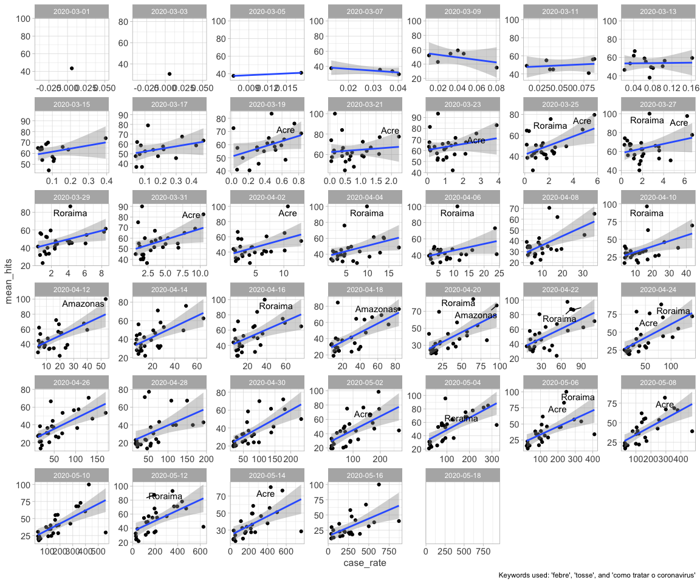

convert dates variables in dates

```r
data <- 
  data %>% 
  mutate(
    date_beg = as.Date(date_beg), 
    date_end = as.Date(date_end)
  )
```
We subset the data to leave only the dates with matches between searches and cases 


```r
dates_match <- 
  data %>%
  count(date_beg) %>% 
  filter(n > 30) %>% 
  pull(date_beg)

df_match <-   
  data %>% 
  filter(date_beg %in% dates_match)
```

# We start by adding graphs for every day available

## Plotting the figure for the keyword febre

```r
df_match %>% 
  filter(date_beg > "2020-02-29", date_end < "2020-04-20", keyword == "tosse") %>%  
  group_by(date_beg, state) %>% 
  summarize(
    mean_hits = mean(hits, na.rm = TRUE), 
    case_rate = mean(case_rate, na.rm = TRUE)
  ) %>% 
  ggplot() + 
  geom_point(aes(case_rate, mean_hits)) + 
  geom_smooth(aes(case_rate, mean_hits), method = "lm") + 
  geom_text_repel(
    data = . %>% filter(mean_hits > 80 | (mean_hits > 60 & date_beg > "2020-04-01")), 
    aes(case_rate, mean_hits, label = state), 
    hjust=0.5, vjust=0.4
  ) + 
  facet_wrap(vars(date_beg), scales = "free") + 
  labs(
    caption = "Keywords used: 'febre'"
  )
```

<!-- -->

# Doing the same graph, but including now "tosse", "febre", and "como tratar o coronavirus"


```r
df_match %>% 
  filter(keyword %in% c("febre", "tosse", "como tratar o coronav<ed>rus"), date_beg > "2020-02-29", date_end < "2020-04-20",) %>% 
  group_by(date_beg, state) %>% 
  summarize(
    mean_hits = mean(hits, na.rm = TRUE), 
    case_rate = mean(case_rate, na.rm = TRUE)
  ) %>% 
  ggplot() + 
  geom_point(aes(case_rate, mean_hits)) + 
  geom_smooth(aes(case_rate, mean_hits), method = "lm") + 
  geom_text_repel(
    data = . %>% filter(mean_hits > 75), 
    aes(case_rate, mean_hits, label = state), 
    hjust=0.5, vjust=0.4
  ) + 
  facet_wrap(vars(date_beg), scales = "free") +
  labs(
    caption = "Keywords used: 'febre', 'tosse', and 'como tratar o coronavirus'"
  )
```

<!-- -->
 
# Same graph but using all keywords extracted


```r
df_match %>% 
  filter(date_beg > "2020-02-29", date_end < "2020-04-20") %>% 
  group_by(date_beg, state) %>% 
  summarize(
    mean_hits = mean(hits, na.rm = TRUE), 
    case_rate = mean(case_rate, na.rm = TRUE)
  ) %>% 
  ggplot() + 
  geom_point(aes(case_rate, mean_hits)) + 
  geom_smooth(aes(case_rate, mean_hits), method = "lm") + 
  geom_text_repel(
    data = . %>% filter(mean_hits > 75), 
    aes(case_rate, mean_hits, label = state), 
    hjust=0.5, vjust=0.4
  ) + 
  facet_wrap(vars(date_beg), scales = "free") +
  labs(
    caption = "Keywords used: 'febre', 'tosse', and 'como tratar o coronavirus'"
  )
```

<!-- -->


# Which are the states with the largest case rate on April 18th?


```r
data %>% 
  filter(date_beg == "2020-04-18") %>% 
  count(case_rate, state) %>% 
  arrange(desc(case_rate)) %>% 
  ggplot()+ 
  geom_col(aes(fct_reorder(state, case_rate), case_rate)) +
  coord_flip() + 
  labs(
    title = "States ordered by case rate on April 18th, 2020", 
    x = "State", 
    y = "Cases per 100,000 people"
  )
```

<!-- -->

# Which are the states with the largest death rate on April 18th?


```r
data %>% 
  filter(date_beg == "2020-04-18") %>% 
  count(death_rate, state) %>% 
  arrange(desc(death_rate)) %>% 
  ggplot()+ 
  geom_col(aes(fct_reorder(state, death_rate), death_rate)) +
  coord_flip() + 
  labs(
    title = "States ordered by death rate on April 18th, 2020", 
    x = "State", 
    y = "Deaths per 100,000 people"
  )
```

<!-- -->


# we now compute the averages at the weekly level 

## Using all keywords

```r
df_match %>% 
  filter(date_beg > "2020-02-29", date_end < "2020-04-20") %>% 
  group_by(date_beg, state) %>% 
  summarize(
    mean_hits = mean(hits, na.rm = TRUE), 
    case_rate = mean(case_rate, na.rm = TRUE)
  ) %>% 
  ggplot() + 
  geom_point(aes(case_rate, mean_hits)) + 
  geom_smooth(aes(case_rate, mean_hits), method = "lm") + 
  geom_text_repel(
    data = . %>% filter(mean_hits > 75), 
    aes(case_rate, mean_hits, label = state), 
    hjust=0.5, vjust=0.4
  ) + 
  facet_wrap(vars(date_beg), scales = "free") +
  labs(
    caption = "Keywords used: 'febre', 'tosse', and 'como tratar o coronavirus'"
  )
```

<!-- -->

# Plotting the keyword "I can't smell"


```r
df_match %>% 
  filter(date_beg > "2020-03-18", date_beg < "2020-04-20", keyword == "perdi o olfato", !is.na(date_beg)) %>% 
  group_by(date_beg, state) %>% 
  summarize(
    mean_hits = mean(hits, na.rm = TRUE), 
    case_rate = mean(case_rate, na.rm = TRUE)
  ) %>% 
  ggplot() + 
  geom_point(aes(case_rate, mean_hits)) + 
  geom_text_repel(
    aes(case_rate, mean_hits, label = state), 
    hjust=0.5, vjust=0.4
  ) + 
  facet_wrap(vars(date_beg), scales = "free") +
  labs(
    caption = "Keywords used: 'Perdi o olfato'"
  )
```

<!-- -->


# METHODOLOGICAL ASPECTS: 
1. Average of key words + admin cases. 

2. Relative (case rate) v. absolute (number of cases). Graphs seem more consistent with relative impact of the virus. Not with absolute impact. Maybe because google searches look for relative values (e.g. searches out of the total searches?)

3. Selection of keywords - very discretional (in a dashboard it's easy to let the user pick; but in a presentation, it is a very discretionary decision)
