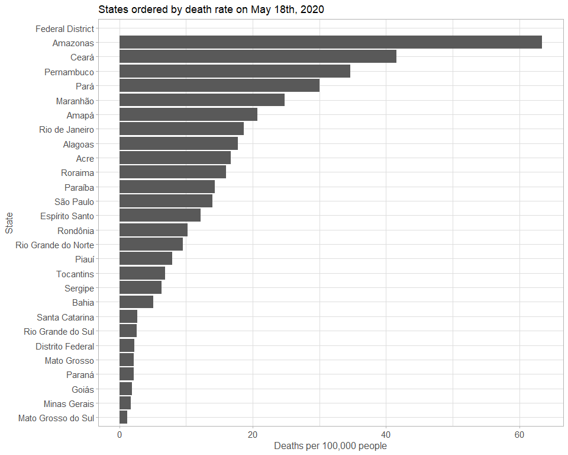
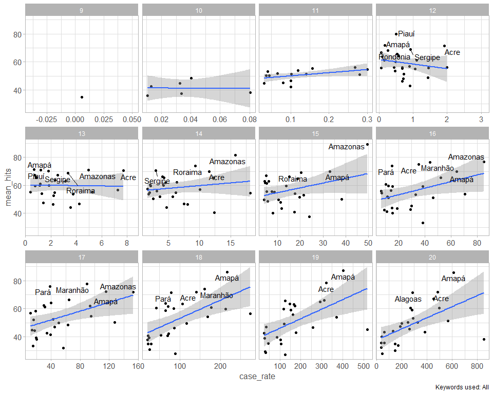
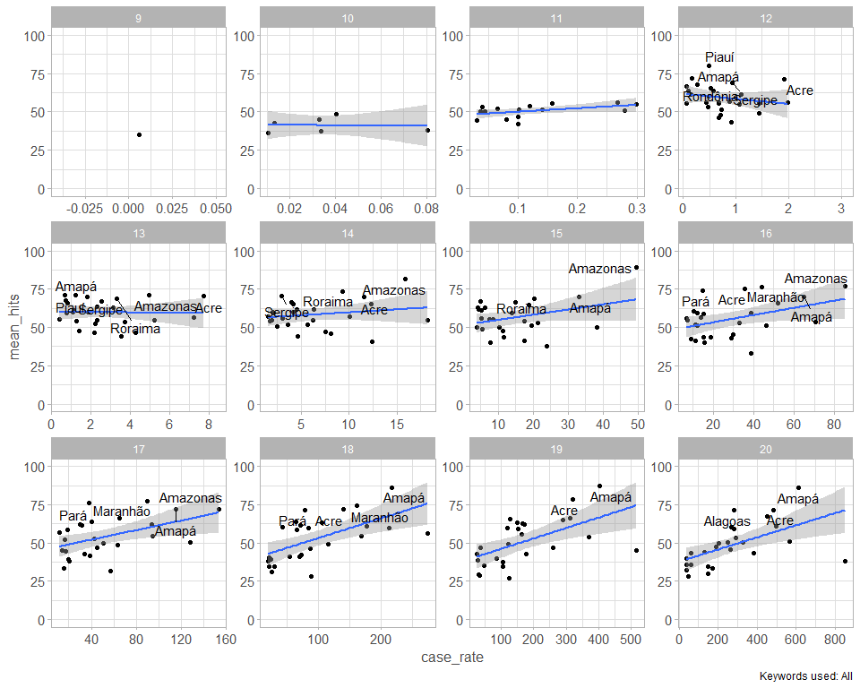

convert dates variables into dates

```r
data <- 
  data %>% 
  mutate(
    date_beg = as.Date(date_beg), 
    date_end = as.Date(date_end)
  )
```

Add week number

```r
data <- 
  data %>% 
  mutate(
    week_number = week(date_beg), 
    day = day(date_beg), 
    month = month(date_beg), 
    wday = wday(date_beg, label = TRUE)
  )
```

We subset the data to leave only the dates with matches between searches and cases 


```r
dates_match <- 
  data %>%
  count(date_beg) %>% 
  filter(n > 30) %>% 
  pull(date_beg)

df_match <-   
  data %>% 
  filter(date_beg %in% dates_match)
```

Find top 6 states in levels

```r
top_6_states_cases <- 
  data %>% 
  filter(date_beg == "2020-04-18") %>% 
  count(state, cases) %>% 
  arrange(desc(cases)) %>% 
  head(6) %>% pull(state)
```

Find states that show up under "I can't smell"

```r
states_cant_smell <-  
  df_match %>% 
  filter(keyword == "perdi o olfato") %>% 
  filter(!is.na(hits)) %>% 
  count(state) %>%
  pull(state)
```

Find the date in which the state first shows under "I can't smell"

```r
states_cant_smell_date <- 
  df_match %>% 
  filter(keyword == "perdi o olfato", state %in% states_cant_smell) %>% 
  filter(!is.na(hits), date_beg > "2020-03-01") %>% 
  group_by(state) %>% 
  summarize(
    first_date_cant_smell = min(date_beg)
  )
```


# We start by adding graphs for every day available

## Plotting the figure for the keyword febre

```r
df_match %>% 
  filter(date_beg > "2020-02-29", keyword == "tosse") %>%  
  group_by(date_beg, state) %>% 
  summarize(
    mean_hits = mean(hits, na.rm = TRUE), 
    case_rate = mean(case_rate, na.rm = TRUE)
  ) %>% 
  ggplot() + 
  geom_point(aes(case_rate, mean_hits)) + 
  geom_smooth(aes(case_rate, mean_hits), method = "lm") + 
  geom_text_repel(
    data = . %>% filter(mean_hits > 80 | (mean_hits > 60 & date_beg > "2020-04-01")), 
    aes(case_rate, mean_hits, label = state), 
    hjust=0.5, vjust=0.4
  ) + 
  facet_wrap(vars(date_beg), scales = "free") + 
  labs(
    caption = "Keywords used: 'febre'"
  )
```

<!-- -->

## Doing the same graph, but including now "tosse", "febre", and "como tratar o coronavirus"


```r
df_match %>% 
  filter(keyword %in% c("febre", "tosse", "como tratar o coronav<ed>rus"), date_beg > "2020-02-29") %>% 
  group_by(date_beg, state) %>% 
  summarize(
    mean_hits = mean(hits, na.rm = TRUE), 
    case_rate = mean(case_rate, na.rm = TRUE)
  ) %>% 
  ggplot() + 
  geom_point(aes(case_rate, mean_hits)) + 
  geom_smooth(aes(case_rate, mean_hits), method = "lm") + 
  geom_text_repel(
    data = . %>% filter(mean_hits > 75), 
    aes(case_rate, mean_hits, label = state), 
    hjust=0.5, vjust=0.4
  ) + 
  facet_wrap(vars(date_beg), scales = "free") +
  labs(
    caption = "Keywords used: 'febre', 'tosse', and 'como tratar o coronavirus'"
  )
```

<!-- -->
 
## Same graph but using all keywords extracted


```r
df_match %>% 
  filter(date_beg > "2020-02-29") %>% 
  group_by(date_beg, state) %>% 
  summarize(
    mean_hits = mean(hits, na.rm = TRUE), 
    case_rate = mean(case_rate, na.rm = TRUE)
  ) %>% 
  ggplot() + 
  geom_point(aes(case_rate, mean_hits)) + 
  geom_smooth(aes(case_rate, mean_hits), method = "lm") + 
  geom_text_repel(
    data = . %>% filter(mean_hits > 75), 
    aes(case_rate, mean_hits, label = state), 
    hjust=0.5, vjust=0.4
  ) + 
  facet_wrap(vars(date_beg), scales = "free") +
  labs(
    caption = "Keywords used: 'febre', 'tosse', and 'como tratar o coronavirus'"
  )
```

<!-- -->


# Which are the states with the largest case rate on April 18th?


```r
data %>% 
  filter(date_beg == "2020-04-30") %>% 
  count(case_rate, state) %>% 
  arrange(desc(case_rate)) %>% 
  ggplot()+ 
  geom_col(aes(fct_reorder(state, case_rate), case_rate)) +
  coord_flip() + 
  labs(
    title = "States ordered by case rate on April 18th, 2020", 
    x = "State", 
    y = "Cases per 100,000 people"
  )
```

<!-- -->

# Which are the states with the largest death rate on April 18th?


```r
data %>% 
  filter(date_beg == "2020-04-30") %>% 
  count(death_rate, state) %>% 
  arrange(desc(death_rate)) %>% 
  ggplot()+ 
  geom_col(aes(fct_reorder(state, death_rate), death_rate)) +
  coord_flip() + 
  labs(
    title = "States ordered by death rate on April 18th, 2020", 
    x = "State", 
    y = "Deaths per 100,000 people"
  )
```

<!-- -->


# We now compute the averages at the weekly level 

## Using all keywords

```r
df_match %>% 
  filter(date_beg > "2020-02-29") %>% 
  group_by(state, week_number) %>% 
  summarize(
    mean_hits = mean(hits, na.rm = TRUE), 
    case_rate = mean(case_rate, na.rm = TRUE)
  ) %>% 
  ggplot() + 
  geom_point(aes(case_rate, mean_hits)) + 
  geom_smooth(aes(case_rate, mean_hits), method = "lm") + 
  geom_text_repel(
    data = . %>% filter(mean_hits > 75), 
    aes(case_rate, mean_hits, label = state), 
    hjust=0.5, vjust=0.4
  ) + 
  facet_wrap(vars(week_number), scales = "free") +
  labs(
    caption = "Keywords used: All"
  )
```

<!-- -->

# Plotting the keyword "I can't smell"


```r
df_match %>% 
  filter(date_beg > "2020-03-18", keyword == "perdi o olfato", !is.na(date_beg)) %>% 
  group_by(date_beg, state) %>% 
  summarize(
    mean_hits = mean(hits, na.rm = TRUE), 
    case_rate = mean(case_rate, na.rm = TRUE)
  ) %>% 
  ggplot() + 
  geom_point(aes(case_rate, mean_hits)) + 
  geom_text_repel(
    aes(case_rate, mean_hits, label = state), 
    hjust=0.5, vjust=0.4
  ) + 
  facet_wrap(vars(date_beg), scales = "free") +
  labs(
    caption = "Keywords used: 'Perdi o olfato'"
  )
```

<!-- -->

# Graph using growth rate (and grouped by key category)

## Growth rate and all keywords


```r
df_match %>% 
  filter(date_beg > "2020-02-29") %>% 
  group_by(state, week_number) %>% 
  summarize(
    mean_hits = mean(hits, na.rm = TRUE), 
    growth_rate_cases = mean(growth_rate_cases, na.rm = TRUE)
  ) %>% 
  ggplot() + 
  geom_point(aes(growth_rate_cases, mean_hits)) + 
  geom_smooth(aes(growth_rate_cases, mean_hits), method = "lm") + 
  geom_text_repel(
    data = . %>% filter(state %in% top_6_states_cases), 
    aes(growth_rate_cases, mean_hits, label = state), 
    hjust=0.5, vjust=0.4
  ) + 
  facet_wrap(vars(week_number), scales = "free") +
  labs(
    caption = "Keywords used: All"
  )
```

<!-- -->

## Growth rate and symptoms


```r
df_match %>% 
  filter(date_beg > "2020-02-29", categories == "symptoms") %>% 
  group_by(state, week_number) %>% 
  summarize(
    mean_hits = mean(hits, na.rm = TRUE), 
    growth_rate_cases = mean(growth_rate_cases, na.rm = TRUE)
  ) %>% 
  ggplot() + 
  geom_point(aes(growth_rate_cases, mean_hits)) + 
  geom_smooth(aes(growth_rate_cases, mean_hits), method = "lm") + 
  geom_text_repel(
    data = . %>% filter(state %in% top_6_states_cases), 
    aes(growth_rate_cases, mean_hits, label = state), 
    hjust=0.5, vjust=0.4
  ) + 
  facet_wrap(vars(week_number), scales = "free") +
  labs(
    caption = "Keywords used: Symptoms related"
  )
```

<!-- -->

## Growth rate and 1st person


```r
df_match %>% count(categories)
```

```
## # A tibble: 3 x 2
##   categories        n
##   <fct>         <int>
## 1 in_1st_person 15157
## 2 symptoms       9450
## 3 virus          5670
```

```r
df_match %>% 
  filter(date_beg > "2020-02-29", categories == "in_1st_person") %>% 
  group_by(state, week_number) %>% 
  summarize(
    mean_hits = mean(hits, na.rm = TRUE), 
    growth_rate_cases = mean(growth_rate_cases, na.rm = TRUE)
  ) %>% 
  ggplot() + 
  geom_point(aes(growth_rate_cases, mean_hits)) + 
  geom_smooth(aes(growth_rate_cases, mean_hits), method = "lm") + 
  geom_text_repel(
    data = . %>% filter(state %in% top_6_states_cases), 
    aes(growth_rate_cases, mean_hits, label = state), 
    hjust=0.5, vjust=0.4
  ) + 
  facet_wrap(vars(week_number), scales = "free") +
  labs(
    caption = "Keywords used: 1st person"
  )
```

<!-- -->

## Growth rate and virus


```r
df_match %>% 
  filter(date_beg > "2020-02-29", categories == "virus") %>% 
  group_by(state, week_number) %>% 
  summarize(
    mean_hits = mean(hits, na.rm = TRUE), 
    growth_rate_cases = mean(growth_rate_cases, na.rm = TRUE)
  ) %>% 
  ggplot() + 
  geom_point(aes(growth_rate_cases, mean_hits)) + 
  geom_smooth(aes(growth_rate_cases, mean_hits), method = "lm") + 
  geom_text_repel(
    data = . %>% filter(state %in% top_6_states_cases), 
    aes(growth_rate_cases, mean_hits, label = state), 
    hjust=0.5, vjust=0.4
  ) + 
  facet_wrap(vars(week_number), scales = "free") +
  labs(
    caption = "Keywords used: Virus related"
  )
```

<!-- -->

# Growth rate and relative hits averaged at the weekly level


```r
df_match %>% 
  filter(date_beg > "2020-02-29") %>% 
  group_by(state, week_number) %>% 
  summarize(
    relative_hits = mean(hits, na.rm = TRUE), 
    growth_rate_cases = mean(growth_rate_cases, na.rm = TRUE)
  ) %>% 
  ggplot() + 
  geom_point(aes(growth_rate_cases, relative_hits)) + 
  geom_smooth(aes(growth_rate_cases, relative_hits), method = "lm") + 
  geom_text_repel(
    data = . %>% filter(state %in% top_6_states_cases), 
    aes(growth_rate_cases, relative_hits, label = state), 
    hjust=0.5, vjust=0.4
  ) + 
  facet_wrap(vars(week_number), scales = "free") +
  labs(
    caption = "Keywords used: All"
  )
```

<!-- -->


# Case rate and death rate per state

## Case rate: Highlighting the states that show up under I can't smell at any point

```r
df_match %>% 
  filter(!is.na(state), !is.na(case_rate)) %>% 
  count(case_rate, date_beg, state) %>% 
  ggplot() +
  geom_line(aes(date_beg, case_rate, group = state, color = fct_reorder2(state, date_beg, case_rate))) +
  geom_line(
    data = . %>% filter(state %in% states_cant_smell),
    aes(date_beg, case_rate, group = state, color = fct_reorder2(state, date_beg, case_rate)), size = 2) +
  labs(
    title = "Case rate per State",
    color = "State"
  )
```

<!-- -->

## Death rate: Highlighting the states that show up under I can't smell at any point

```r
df_match %>% 
  filter(!is.na(state), !is.na(death_rate)) %>% 
  count(death_rate, date_beg, state) %>% 
  ggplot() +
  geom_line(aes(date_beg, death_rate, group = state, color = fct_reorder2(state, date_beg, death_rate))) +
  geom_line(
    data = . %>% filter(state %in% states_cant_smell),
    aes(date_beg, death_rate, group = state, color = fct_reorder2(state, date_beg, death_rate)), size = 2) +
  labs(
    title = "Death rate per State",
    color = "State"
  )
```

<!-- -->

## Date of showing up "I can't smell"


```r
df_match %>% 
  filter(!is.na(state), !is.na(death_rate), state %in% states_cant_smell) %>% 
  count(death_rate, date_beg, state) %>% 
  ggplot() +
  geom_line(aes(date_beg, death_rate, group = state, color = fct_reorder2(state, date_beg, death_rate))) +
  geom_vline(
    data = states_cant_smell_date, 
    aes(xintercept = first_date_cant_smell, group = state, color = state)
  ) +
  geom_label_repel(
    data = states_cant_smell_date, 
    aes(first_date_cant_smell, y = 80, label = state), 
    hjust=0.5, vjust=0.4
  ) + 
  labs(
    title = "Death rate per State",
    color = "State"
  )
```

<!-- -->

## Same but using logarithmic scale (legend ordered by the first time the state shows in the data)

```r
df_match %>% 
  filter(!is.na(state), !is.na(death_rate), state %in% states_cant_smell) %>% 
  count(death_rate, date_beg, state) %>% 
  ggplot() +
  geom_line(aes(date_beg, death_rate, group = state, color = fct_reorder2(state, date_beg, death_rate, .fun = first2))) +
  geom_vline(
    data = states_cant_smell_date, 
    aes(xintercept = first_date_cant_smell)
  ) +
  geom_label_repel(
    data = states_cant_smell_date, 
    aes(first_date_cant_smell, y = 80, label = state), 
    hjust=0.5, vjust=0.4
  ) + 
  labs(
    title = "Death rate per State",
    color = "State"
  ) +
  scale_y_log10()
```

<!-- -->


# Next steps: 

- Add states curves in a couple of graphs. See if there is variation in growth rates across states
- check why we have missing data for relative hits + how to deal with it


# Methodological aspects: 

1. Average of key words + admin cases. 
2. Relative (case rate) v. absolute (number of cases)
3. Selection of keywords - use key categories
4. missing values in relative_hits
