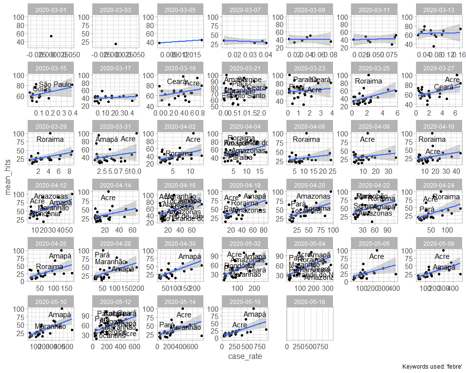
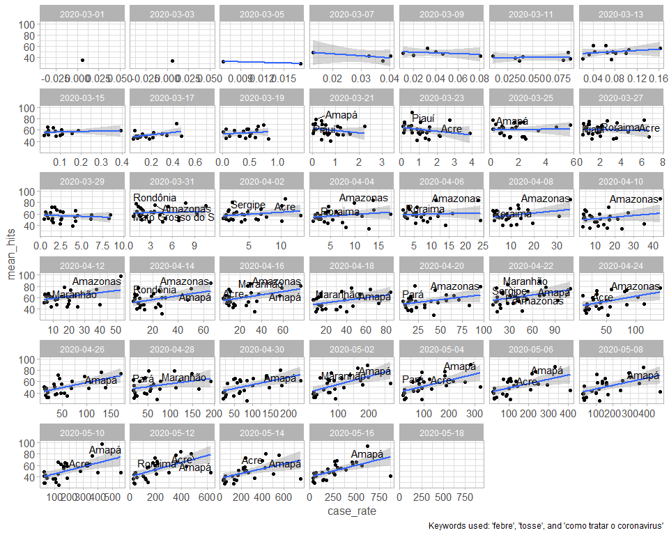
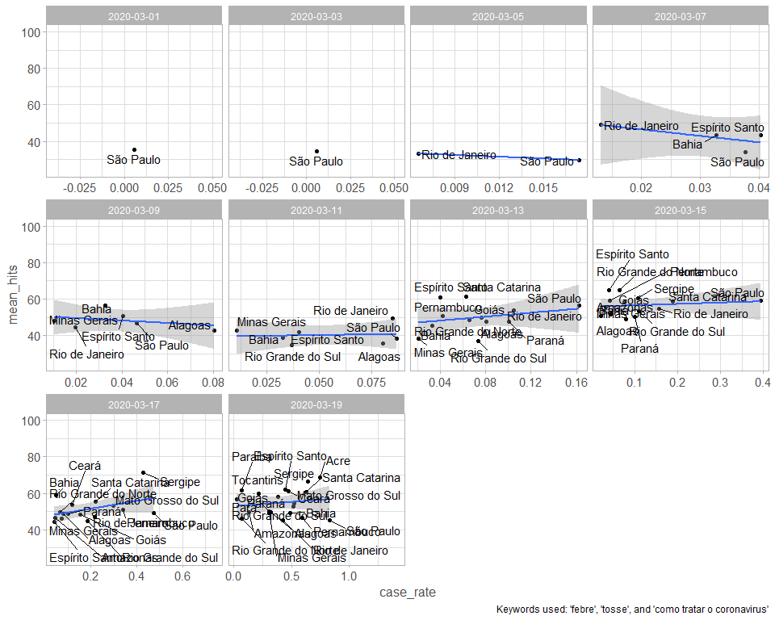
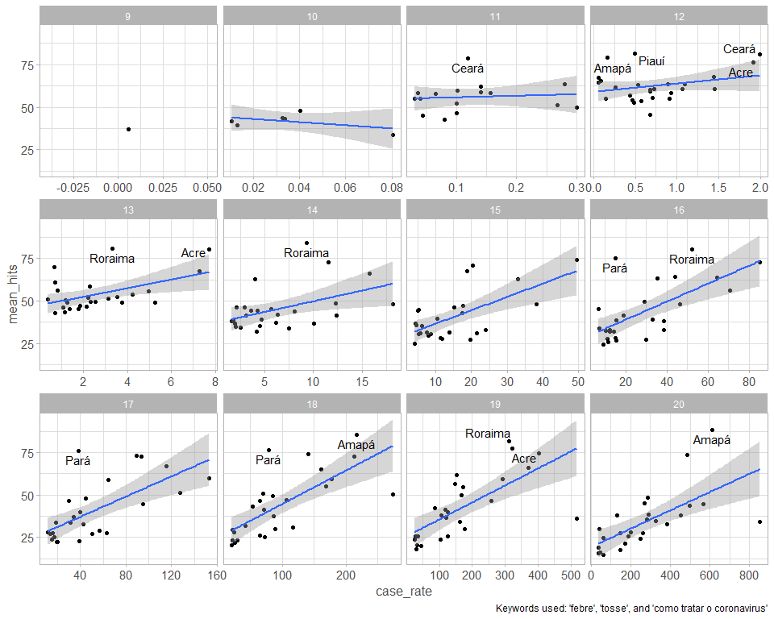
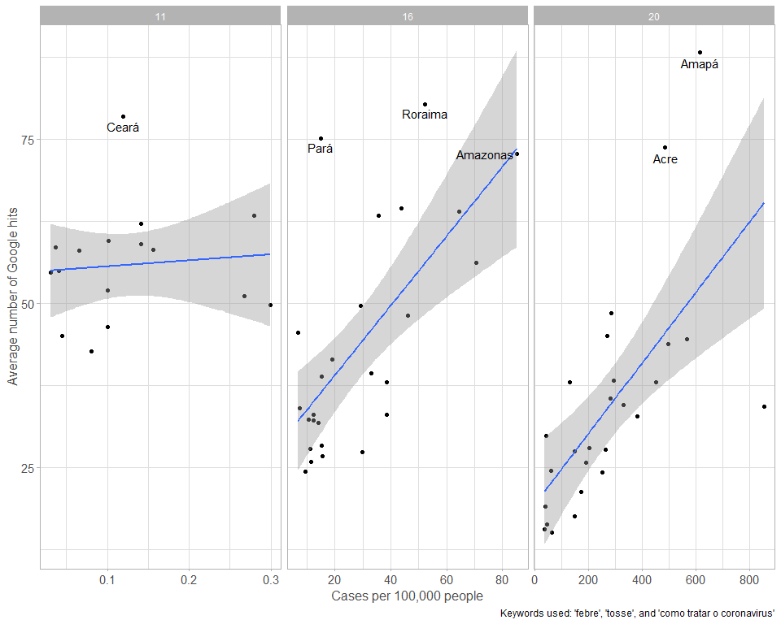
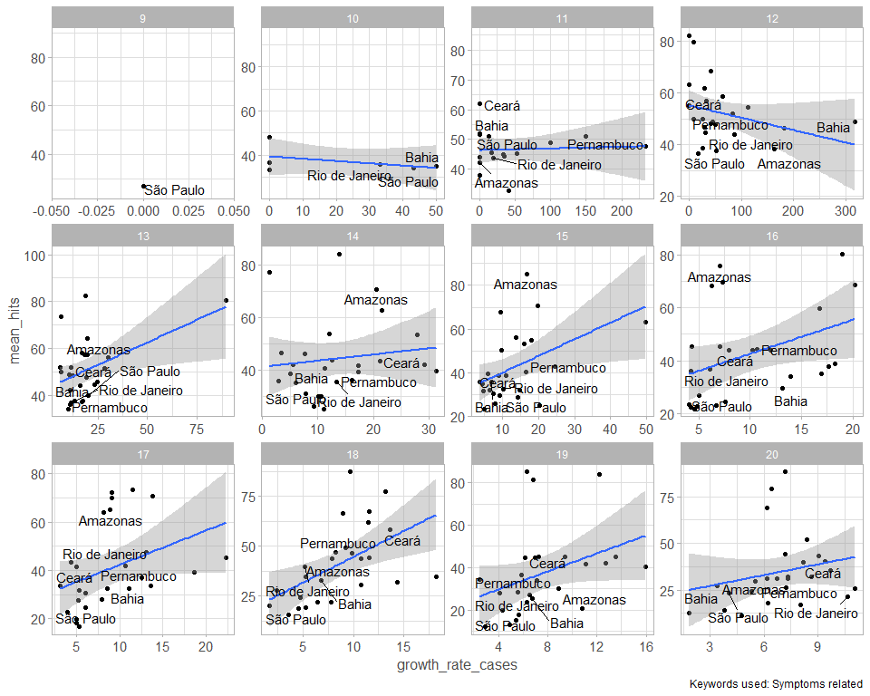
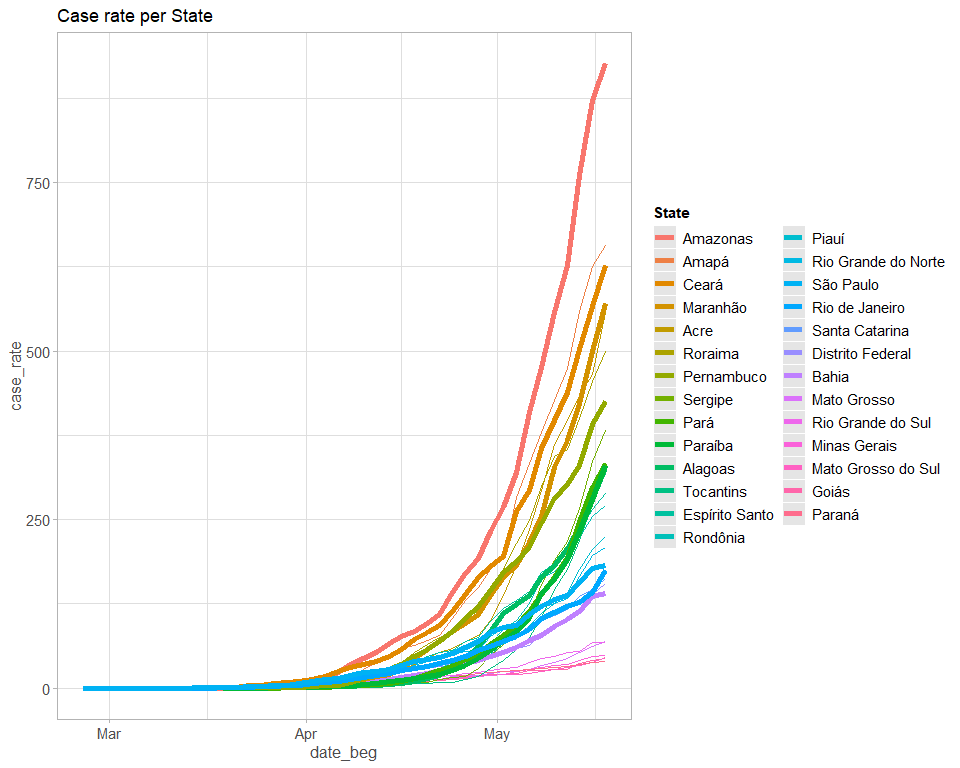
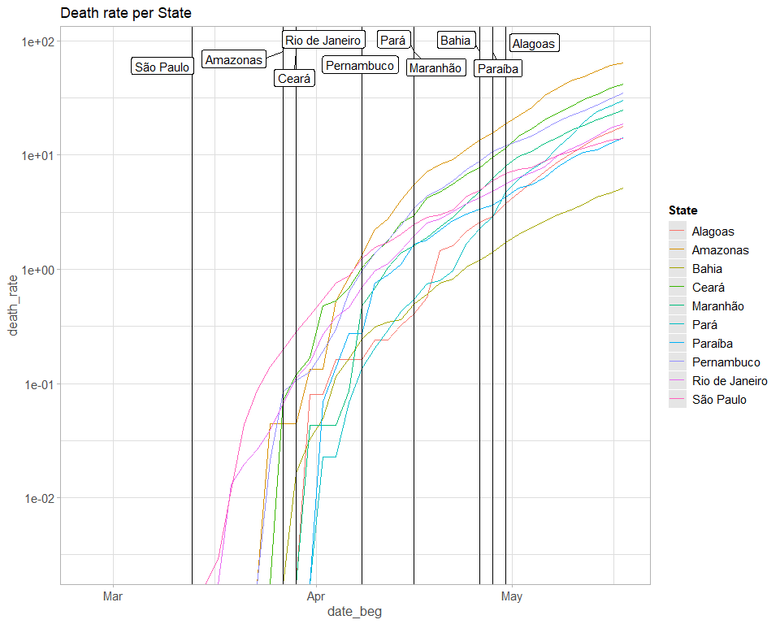
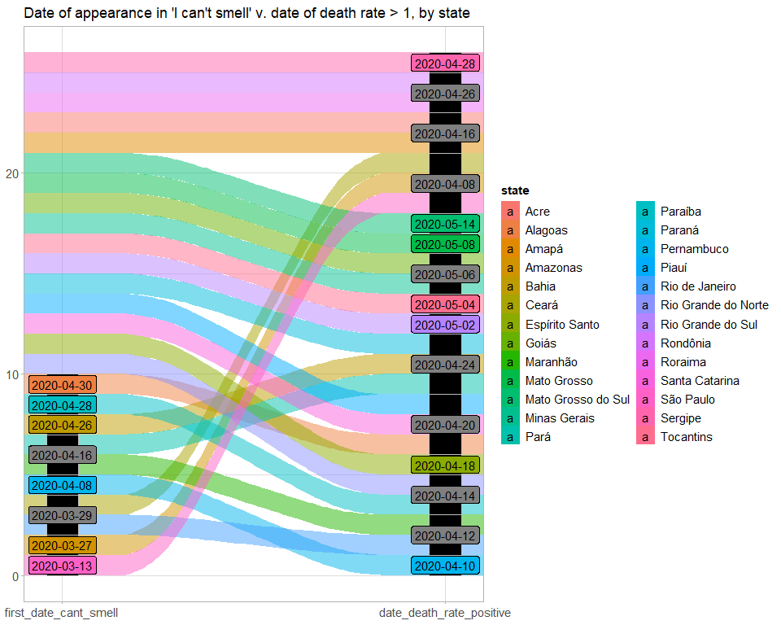

convert dates variables into dates

```r
data <- 
  data %>% 
  mutate(
    date_beg = as.Date(date_beg), 
    date_end = as.Date(date_end)
  )
```

Add week number

```r
data <- 
  data %>% 
  mutate(
    week_number = week(date_beg), 
    day = day(date_beg), 
    month = month(date_beg), 
    wday = wday(date_beg, label = TRUE)
  )
```

We subset the data to leave only the dates with matches between searches and cases 


```r
dates_match <- 
  data %>%
  count(date_beg) %>% 
  filter(n > 30) %>% 
  pull(date_beg)

df_match <-   
  data %>% 
  filter(date_beg %in% dates_match)
```

Find top 6 states in levels

```r
top_6_states_cases <- 
  data %>% 
  filter(date_beg == "2020-04-18") %>% 
  count(state, cases) %>% 
  arrange(desc(cases)) %>% 
  head(6) %>% pull(state)
```

Find states that show up under "I can't smell"

```r
states_cant_smell <-  
  df_match %>% 
  filter(keyword == "perdi o olfato") %>% 
  filter(!is.na(hits)) %>% 
  count(state) %>%
  pull(state)
```

Find the date in which the state first shows under "I can't smell"

```r
states_cant_smell_date <- 
  df_match %>% 
  filter(keyword == "perdi o olfato", state %in% states_cant_smell) %>% 
  filter(!is.na(hits), date_beg > "2020-03-01") %>% 
  group_by(state) %>% 
  summarize(
    first_date_cant_smell = min(date_beg)
  )

# Add a ranking
states_cant_smell_date <- 
  states_cant_smell_date %>% 
  arrange(first_date_cant_smell) %>% 
  mutate(ranking_cant_smell = rank(first_date_cant_smell))
```

Find the date in which each state has its first death, then its 5th or more deaths, then its 20th or more deaths


```r
date_1_death <- 
  df_match %>% 
  filter(keyword == "tosse") %>%
  mutate(deaths_positive = if_else(deaths > 0, 1L, 0L)) %>% 
  filter(deaths_positive == 1L) %>% 
  group_by(state) %>% 
  summarize(
    date_death_1 = min(date_beg)
  ) %>% 
  mutate(ranking_death_1 = rank(date_death_1))

# Now with 10 deaths
date_10_deaths <- 
  df_match %>% 
  filter(keyword == "tosse") %>%
  mutate(deaths_10 = if_else(deaths > 10, 1L, 0L)) %>% 
  filter(deaths_10 == 1L) %>% 
  group_by(state) %>% 
  summarize(
    date_death_10 = min(date_beg)
  ) %>% 
  mutate(ranking_death_10 = rank(date_death_10))

# Now with 20 deaths
date_20_deaths <- 
  df_match %>% 
  filter(keyword == "tosse") %>%
  mutate(deaths_20 = if_else(deaths > 20, 1L, 0L)) %>% 
  filter(deaths_20 == 1L) %>% 
  group_by(state) %>% 
  summarize(
    date_death_20 = min(date_beg)
  ) %>% 
  mutate(ranking_death_20 = rank(date_death_20))

# Now with 100 deaths
date_100_deaths <- 
  df_match %>% 
  filter(keyword == "tosse") %>%
  mutate(deaths_100 = if_else(deaths > 100, 1L, 0L)) %>% 
  filter(deaths_100 == 1L) %>% 
  group_by(state) %>% 
  summarize(
    date_death_100 = min(date_beg)
  ) %>% 
  mutate(ranking_death_100 = rank(date_death_100))

# Now with 500 deaths
date_500_deaths <- 
  df_match %>% 
  filter(keyword == "tosse") %>%
  mutate(deaths_500 = if_else(deaths > 500, 1L, 0L)) %>% 
  filter(deaths_500 == 1L) %>% 
  group_by(state) %>% 
  summarize(
    date_death_500 = min(date_beg)
  ) %>% 
  mutate(ranking_death_500 = rank(date_death_500))

# Now with 500 deaths
date_1000_deaths <- 
  df_match %>% 
  filter(keyword == "tosse") %>%
  mutate(deaths_1000 = if_else(deaths > 1000, 1L, 0L)) %>% 
  filter(deaths_1000 == 1L) %>% 
  group_by(state) %>% 
  summarize(
    date_death_1000 = min(date_beg)
  ) %>% 
  mutate(ranking_death_1000 = rank(date_death_1000))


#Deaths on May 18th
may_18_deaths <- 
  data %>% 
  filter(date_beg == "2020-05-18") %>% 
  count(deaths, state) %>% 
  arrange(desc(deaths)) %>% 
  dplyr::select(state, deaths_may_18 = deaths)


dates_deaths_dataset <- 
  date_1_death %>% 
  left_join(date_10_deaths) %>% 
  left_join(date_20_deaths) %>% 
  left_join(date_100_deaths) %>% 
  left_join(date_500_deaths) %>% 
  left_join(date_1000_deaths) %>% 
  left_join(states_cant_smell_date) %>% 
  left_join(may_18_deaths)
```

Find the date in which each state has a death rate greater or equal to 1


```r
date_1_death_rate <- 
  df_match %>% 
  filter(keyword == "tosse") %>%
  mutate(death_rate_positive = if_else(death_rate > 1, 1L, 0L)) %>% 
  filter(death_rate_positive == 1L) %>% 
  group_by(state) %>% 
  summarize(
    date_death_rate_positive = min(date_beg)
  ) %>% 
  mutate(ranking_death_rate = rank(date_death_rate_positive))
```


# We start by adding graphs for every day available

## Plotting the figure for the keyword febre

```r
df_match %>% 
  filter(date_beg > "2020-02-29", keyword == "tosse") %>%  
  group_by(date_beg, state) %>% 
  summarize(
    mean_hits = mean(hits, na.rm = TRUE), 
    case_rate = mean(case_rate, na.rm = TRUE)
  ) %>% 
  ggplot() + 
  geom_point(aes(case_rate, mean_hits)) + 
  geom_smooth(aes(case_rate, mean_hits), method = "lm") + 
  geom_text_repel(
    data = . %>% filter(mean_hits > 80 | (mean_hits > 60 & date_beg > "2020-04-01")), 
    aes(case_rate, mean_hits, label = state), 
    hjust=0.5, vjust=0.4
  ) + 
  facet_wrap(vars(date_beg), scales = "free") + 
  labs(
    caption = "Keywords used: 'febre'"
  )
```

<!-- -->

## Doing the same graph, but including now "tosse", "febre", and "como tratar o coronavirus"


```r
df_match %>% 
  filter(keyword %in% c("febre", "tosse", "como tratar o coronav<ed>rus"), date_beg > "2020-02-29") %>% 
  group_by(date_beg, state) %>% 
  summarize(
    mean_hits = mean(hits, na.rm = TRUE), 
    case_rate = mean(case_rate, na.rm = TRUE)
  ) %>% 
  ggplot() + 
  geom_point(aes(case_rate, mean_hits)) + 
  geom_smooth(aes(case_rate, mean_hits), method = "lm") + 
  geom_text_repel(
    data = . %>% filter(mean_hits > 75), 
    aes(case_rate, mean_hits, label = state), 
    hjust=0.5, vjust=0.4
  ) + 
  facet_wrap(vars(date_beg), scales = "free_x") +
  labs(
    caption = "Keywords used: 'febre', 'tosse', and 'como tratar o coronavirus'"
  )
```

<!-- -->
 
## Same graph but using all keywords extracted


```r
df_match %>% 
  filter(date_beg > "2020-02-29") %>% 
  group_by(date_beg, state) %>% 
  summarize(
    mean_hits = mean(hits, na.rm = TRUE), 
    case_rate = mean(case_rate, na.rm = TRUE)
  ) %>% 
  ggplot() + 
  geom_point(aes(case_rate, mean_hits)) + 
  geom_smooth(aes(case_rate, mean_hits), method = "lm") + 
  geom_text_repel(
    data = . %>% filter(mean_hits > 75), 
    aes(case_rate, mean_hits, label = state), 
    hjust=0.5, vjust=0.4
  ) + 
  facet_wrap(vars(date_beg), scales = "free_x") +
  labs(
    caption = "Keywords used: 'febre', 'tosse', and 'como tratar o coronavirus'"
  )
```

<!-- -->


Showing the states where  any keywords appeared earlier in time

```r
df_match %>% 
  filter(date_beg > "2020-02-29", date_beg < "2020-03-20") %>% 
  group_by(date_beg, state) %>% 
  summarize(
    mean_hits = mean(hits, na.rm = TRUE), 
    case_rate = mean(case_rate, na.rm = TRUE)
  ) %>% 
  ggplot() + 
  geom_point(aes(case_rate, mean_hits)) + 
  geom_smooth(aes(case_rate, mean_hits), method = "lm") + 
  geom_text_repel(
    aes(case_rate, mean_hits, label = state), 
    hjust=0.5, vjust=0.4
  ) + 
  facet_wrap(vars(date_beg), scales = "free_x") +
  labs(
    caption = "Keywords used: 'febre', 'tosse', and 'como tratar o coronavirus'"
  )
```

<!-- -->


# Which are the states with the largest case rate on May 18th?


```r
data %>% 
  filter(date_beg == "2020-05-18") %>% 
  count(case_rate, state) %>% 
  arrange(desc(case_rate)) %>% 
  ggplot()+ 
  geom_col(aes(fct_reorder(state, case_rate), case_rate)) +
  coord_flip() + 
  labs(
    title = "States ordered by case rate on May 18th, 2020", 
    x = "State", 
    y = "Cases per 100,000 people"
  )
```

<!-- -->

# Which are the states with the largest death rate on May 18th?


```r
data %>% 
  filter(date_beg == "2020-05-18") %>% 
  count(death_rate, state) %>% 
  arrange(desc(death_rate)) %>% 
  ggplot()+ 
  geom_col(aes(fct_reorder(state, death_rate), death_rate)) +
  coord_flip() + 
  labs(
    title = "States ordered by death rate on May 18th, 2020", 
    x = "State", 
    y = "Deaths per 100,000 people"
  )
```

<!-- -->


# We now compute the averages at the weekly level 

## Using 3 main keywords: "febre", "tosse", and como tratar o coronavirus"


```r
df_match %>% 
  filter(keyword %in% c("febre", "tosse", "como tratar o coronav<ed>rus"), date_beg > "2020-02-29") %>% 
  group_by(state, week_number) %>% 
  summarize(
    mean_hits = mean(hits, na.rm = TRUE), 
    case_rate = mean(case_rate, na.rm = TRUE)
  ) %>% 
  ggplot() + 
  geom_point(aes(case_rate, mean_hits)) + 
  geom_smooth(aes(case_rate, mean_hits), method = "lm") + 
  geom_text_repel(
    data = . %>% filter(mean_hits > 75), 
    aes(case_rate, mean_hits, label = state), 
    hjust=0.5, vjust=0.4
  ) + 
  facet_wrap(vars(week_number), scales = "free_x") +
  labs(
    caption = "Keywords used: 'febre', 'tosse', and 'como tratar o coronavirus'"
  )
```

<!-- -->

## Using all keywords

```r
df_match %>% 
  filter(date_beg > "2020-02-29") %>% 
  group_by(state, week_number) %>% 
  summarize(
    mean_hits = mean(hits, na.rm = TRUE), 
    case_rate = mean(case_rate, na.rm = TRUE)
  ) %>% 
  ggplot() + 
  geom_point(aes(case_rate, mean_hits)) + 
  geom_smooth(aes(case_rate, mean_hits), method = "lm") + 
  geom_text_repel(
    data = . %>% filter(mean_hits > 68), 
    aes(case_rate, mean_hits, label = state), 
    hjust=0.5, vjust=0.4
  ) + 
  facet_wrap(vars(week_number), scales = "free_x") +
  labs(
    caption = "Keywords used: All"
  )
```

<!-- -->

## Using all keywords, highlighting more names to find the outliers and leaving the scales free

```r
df_match %>% 
  filter(date_beg > "2020-02-29") %>%
  group_by(state, week_number) %>% 
  summarize(
    mean_hits = mean(hits, na.rm = TRUE), 
    case_rate = mean(case_rate, na.rm = TRUE)
  ) %>% 
  ggplot() + 
  geom_point(aes(case_rate, mean_hits)) + 
  geom_smooth(aes(case_rate, mean_hits), method = "lm") + 
  geom_text_repel(
    data = . %>% filter(mean_hits > 68), 
    aes(case_rate, mean_hits, label = state), 
    hjust=0.5, vjust=0.4
  ) + 
  facet_wrap(vars(week_number), scales = "free") +
  labs(
    caption = "Keywords used: All"
  ) +
  coord_cartesian(y = c(0, 100))
```

<!-- -->

## 3 words, 3 weeks


```r
df_match %>% 
  filter(
    keyword %in% c("febre", "tosse", "como tratar o coronav<ed>rus"), 
    date_beg > "2020-02-29", 
    week_number %in% c(11, 16, 20)
  ) %>% 
  group_by(state, week_number) %>% 
  summarize(
    mean_hits = mean(hits, na.rm = TRUE), 
    case_rate = mean(case_rate, na.rm = TRUE)
  ) %>% 
  ggplot() + 
  geom_point(aes(case_rate, mean_hits)) + 
  geom_smooth(aes(case_rate, mean_hits), method = "lm") + 
  geom_text_repel(
    data = . %>% filter(mean_hits > 72), 
    aes(case_rate, mean_hits, label = state), 
    hjust=0.5, vjust=0.4
  ) + 
  facet_wrap(vars(week_number), scales = "free_x") +
  labs(
    y = "Average number of Google hits",
    x = "Cases per 100,000 people",
    caption = "Keywords used: 'febre', 'tosse', and 'como tratar o coronavirus'"
  )
```

<!-- -->


# Plotting the keyword "I can't smell"


```r
df_match %>% 
  filter(date_beg > "2020-03-18", keyword == "perdi o olfato", !is.na(date_beg)) %>% 
  group_by(date_beg, state) %>% 
  summarize(
    mean_hits = mean(hits, na.rm = TRUE), 
    case_rate = mean(case_rate, na.rm = TRUE)
  ) %>% 
  ggplot() + 
  geom_point(aes(case_rate, mean_hits)) + 
  geom_text_repel(
    aes(case_rate, mean_hits, label = state), 
    hjust=0.5, vjust=0.4
  ) + 
  facet_wrap(vars(date_beg), scales = "free") +
  labs(
    caption = "Keywords used: 'Perdi o olfato'"
  )
```

<!-- -->

# Graph using growth rate (and grouped by key category)

## Growth rate and all keywords


```r
df_match %>% 
  filter(date_beg > "2020-02-29") %>% 
  group_by(state, week_number) %>% 
  summarize(
    mean_hits = mean(hits, na.rm = TRUE), 
    growth_rate_cases = mean(growth_rate_cases, na.rm = TRUE)
  ) %>% 
  ggplot() + 
  geom_point(aes(growth_rate_cases, mean_hits)) + 
  geom_smooth(aes(growth_rate_cases, mean_hits), method = "lm") + 
  geom_text_repel(
    data = . %>% filter(state %in% top_6_states_cases), 
    aes(growth_rate_cases, mean_hits, label = state), 
    hjust=0.5, vjust=0.4
  ) + 
  facet_wrap(vars(week_number), scales = "free") +
  labs(
    caption = "Keywords used: All"
  )
```

<!-- -->

## Growth rate and symptoms


```r
df_match %>% 
  filter(date_beg > "2020-02-29", categories == "symptoms") %>% 
  group_by(state, week_number) %>% 
  summarize(
    mean_hits = mean(hits, na.rm = TRUE), 
    growth_rate_cases = mean(growth_rate_cases, na.rm = TRUE)
  ) %>% 
  ggplot() + 
  geom_point(aes(growth_rate_cases, mean_hits)) + 
  geom_smooth(aes(growth_rate_cases, mean_hits), method = "lm") + 
  geom_text_repel(
    data = . %>% filter(state %in% top_6_states_cases), 
    aes(growth_rate_cases, mean_hits, label = state), 
    hjust=0.5, vjust=0.4
  ) + 
  facet_wrap(vars(week_number), scales = "free") +
  labs(
    caption = "Keywords used: Symptoms related"
  )
```

<!-- -->

## Growth rate and 1st person


```r
df_match %>% count(categories)
```

```
## # A tibble: 3 x 2
##   categories        n
##   <fct>         <int>
## 1 in_1st_person 15157
## 2 symptoms       9450
## 3 virus          5670
```

```r
df_match %>% 
  filter(date_beg > "2020-02-29", categories == "in_1st_person") %>% 
  group_by(state, week_number) %>% 
  summarize(
    mean_hits = mean(hits, na.rm = TRUE), 
    growth_rate_cases = mean(growth_rate_cases, na.rm = TRUE)
  ) %>% 
  ggplot() + 
  geom_point(aes(growth_rate_cases, mean_hits)) + 
  geom_smooth(aes(growth_rate_cases, mean_hits), method = "lm") + 
  geom_text_repel(
    data = . %>% filter(state %in% top_6_states_cases), 
    aes(growth_rate_cases, mean_hits, label = state), 
    hjust=0.5, vjust=0.4
  ) + 
  facet_wrap(vars(week_number), scales = "free") +
  labs(
    caption = "Keywords used: 1st person"
  )
```

<!-- -->

## Growth rate and virus


```r
df_match %>% 
  filter(date_beg > "2020-02-29", categories == "virus") %>% 
  group_by(state, week_number) %>% 
  summarize(
    mean_hits = mean(hits, na.rm = TRUE), 
    growth_rate_cases = mean(growth_rate_cases, na.rm = TRUE)
  ) %>% 
  ggplot() + 
  geom_point(aes(growth_rate_cases, mean_hits)) + 
  geom_smooth(aes(growth_rate_cases, mean_hits), method = "lm") + 
  geom_text_repel(
    data = . %>% filter(state %in% top_6_states_cases), 
    aes(growth_rate_cases, mean_hits, label = state), 
    hjust=0.5, vjust=0.4
  ) + 
  facet_wrap(vars(week_number), scales = "free") +
  labs(
    caption = "Keywords used: Virus related"
  )
```

<!-- -->

# Growth rate and relative hits averaged at the weekly level


```r
df_match %>% 
  filter(date_beg > "2020-02-29") %>% 
  group_by(state, week_number) %>% 
  summarize(
    relative_hits = mean(hits, na.rm = TRUE), 
    growth_rate_cases = mean(growth_rate_cases, na.rm = TRUE)
  ) %>% 
  ggplot() + 
  geom_point(aes(growth_rate_cases, relative_hits)) + 
  geom_smooth(aes(growth_rate_cases, relative_hits), method = "lm") + 
  geom_text_repel(
    data = . %>% filter(state %in% top_6_states_cases), 
    aes(growth_rate_cases, relative_hits, label = state), 
    hjust=0.5, vjust=0.4
  ) + 
  facet_wrap(vars(week_number), scales = "free") +
  labs(
    caption = "Keywords used: All"
  )
```

<!-- -->


# Case rate and death rate per state

## Case rate: Highlighting the states that show up under I can't smell at any point

```r
df_match %>% 
  filter(!is.na(state), !is.na(case_rate)) %>% 
  count(case_rate, date_beg, state) %>% 
  ggplot() +
  geom_line(aes(date_beg, case_rate, group = state, color = fct_reorder2(state, date_beg, case_rate))) +
  geom_line(
    data = . %>% filter(state %in% states_cant_smell),
    aes(date_beg, case_rate, group = state, color = fct_reorder2(state, date_beg, case_rate)), size = 2) +
  labs(
    title = "Case rate per State",
    color = "State"
  )
```

<!-- -->

## Cases: Highlighting the states that show up under I can't smell at any point

```r
df_match %>% 
  filter(!is.na(state), !is.na(case_rate)) %>% 
  count(cases, date_beg, state) %>% 
  ggplot() +
  geom_line(aes(date_beg, cases, group = state, color = fct_reorder2(state, date_beg, cases))) +
  geom_line(
    data = . %>% filter(state %in% states_cant_smell),
    aes(date_beg, cases, group = state, color = fct_reorder2(state, date_beg, cases)), size = 2) +
  labs(
    title = "Cases per State",
    color = "State"
  )
```

<!-- -->

## Death rate: Highlighting the states that show up under I can't smell at any point

```r
df_match %>% 
  filter(!is.na(state), !is.na(death_rate)) %>% 
  count(death_rate, date_beg, state) %>% 
  ggplot() +
  geom_line(aes(date_beg, death_rate, group = state, color = fct_reorder2(state, date_beg, death_rate))) +
  geom_line(
    data = . %>% filter(state %in% states_cant_smell),
    aes(date_beg, death_rate, group = state, color = fct_reorder2(state, date_beg, death_rate)), size = 2) +
  labs(
    title = "Death rate per State",
    color = "State"
  )
```

<!-- -->

## Deaths: Highlighting the states that show up under I can't smell at any point

```r
df_match %>% 
  filter(!is.na(state), !is.na(deaths)) %>% 
  count(deaths, date_beg, state) %>% 
  ggplot() +
  geom_line(aes(date_beg, deaths, group = state, color = fct_reorder2(state, date_beg, deaths))) +
  geom_line(
    data = . %>% filter(state %in% states_cant_smell),
    aes(date_beg, deaths, group = state, color = fct_reorder2(state, date_beg, deaths)), size = 2) +
  labs(
    title = "Deaths per State",
    color = "State"
  )
```

<!-- -->

## Date of showing up "I can't smell"


```r
df_match %>% 
  filter(!is.na(state), !is.na(death_rate), state %in% states_cant_smell) %>% 
  count(death_rate, date_beg, state) %>% 
  ggplot() +
  geom_line(aes(date_beg, death_rate, group = state, color = fct_reorder2(state, date_beg, death_rate))) +
  geom_vline(
    data = states_cant_smell_date, 
    aes(xintercept = first_date_cant_smell, group = state, color = state)
  ) +
  geom_label_repel(
    data = states_cant_smell_date, 
    aes(first_date_cant_smell, y = 80, label = state), 
    hjust=0.5, vjust=0.4
  ) + 
  labs(
    title = "Death rate per State",
    color = "State"
  )
```

<!-- -->


## Date of showing up "I can't smell" & deaths (instead of death rate)


```r
df_match %>% 
  filter(!is.na(state), !is.na(death_rate), state %in% states_cant_smell) %>% 
  count(deaths, date_beg, state) %>% 
  ggplot() +
  geom_line(aes(date_beg, deaths, group = state, color = fct_reorder2(state, date_beg, deaths))) +
  geom_vline(
    data = states_cant_smell_date, 
    aes(xintercept = first_date_cant_smell, group = state)
  ) +
  geom_label_repel(
    data = states_cant_smell_date, 
    aes(first_date_cant_smell, y = 4500, label = state), 
    hjust=0.5, vjust=0.4
  ) + 
  labs(
    title = "Deaths per State",
    color = "State"
  )
```

<!-- -->


## Same but using logarithmic scale (legend ordered by the first time the state shows in the data)

```r
df_match %>% 
  filter(!is.na(state), !is.na(death_rate), state %in% states_cant_smell) %>% 
  count(death_rate, date_beg, state) %>% 
  ggplot() +
  geom_line(aes(date_beg, death_rate, group = state, color = fct_reorder2(state, date_beg, death_rate, .fun = first2))) +
  geom_vline(
    data = states_cant_smell_date, 
    aes(xintercept = first_date_cant_smell)
  ) +
  geom_label_repel(
    data = states_cant_smell_date, 
    aes(first_date_cant_smell, y = 80, label = state), 
    hjust=0.5, vjust=0.4
  ) + 
  labs(
    title = "Death rate per State",
    color = "State"
  ) +
  scale_y_log10()
```

<!-- -->


# Alluvial plot

There are 2 datasets we want to compare, which were computed at the beginning: states_cant_smell_date, date_5_deaths. 
States_cant_smell_date: includes the first date in which a state shows up under "I can't smell", and a ranking of all states
date_5_deaths: includes the first date in which a state has 10 deaths, and a ranking of all states

We first need to merge them by state


```r
date_10_deaths %>% 
  left_join(states_cant_smell_date, by = "state")
```

```
## # A tibble: 26 x 5
##    state     date_death_10 ranking_death_10 first_date_cant_sm~ ranking_cant_sm~
##    <fct>     <date>                   <dbl> <date>                         <dbl>
##  1 Acre      2020-04-24                20   NA                              NA  
##  2 Alagoas   2020-04-20                18   2020-04-30                      10  
##  3 Amapá     2020-04-20                18   NA                              NA  
##  4 Amazonas  2020-04-04                 4.5 2020-03-27                       2  
##  5 Bahia     2020-04-08                 9   2020-04-26                       8  
##  6 Ceará     2020-04-02                 3   2020-03-29                       3.5
##  7 Espírito~ 2020-04-14                16   NA                              NA  
##  8 Goiás     2020-04-12                14.5 NA                              NA  
##  9 Maranhão  2020-04-08                 9   2020-04-16                       6.5
## 10 Mato Gro~ 2020-04-28                22   NA                              NA  
## # ... with 16 more rows
```

Merging data frame of death rate 1 with data frame of cant smell

```r
df_dr_1_cant_smell <- 
  date_1_death_rate %>% 
  left_join(states_cant_smell_date, by = "state") %>% 
  arrange(ranking_death_rate)

#converting dates to factor
df_dr_1_cant_smell <- 
  df_dr_1_cant_smell %>% 
  group_by(state) %>% 
  mutate_at(vars(first_date_cant_smell, date_death_rate_positive), ~factor(., ordered = TRUE)) %>%
  arrange(first_date_cant_smell, date_death_rate_positive) 
```

We now use it for an alluvial plot


```r
df_dr_1_cant_smell %>%
  mutate_at(vars(first_date_cant_smell, date_death_rate_positive), ~factor(., ordered = TRUE)) %>%
  arrange(ranking_cant_smell, ranking_death_rate) %>% 
  ggplot(aes(axis1 = first_date_cant_smell, axis2 = date_death_rate_positive, fill = state)) +
  geom_alluvium() +
  geom_stratum(width = 1/12, fill = "black", color = "grey") +
  geom_label(stat = "stratum", infer.label = TRUE) 
```

<!-- -->

```r
df_dr_1_cant_smell %>%
  mutate_at(vars(first_date_cant_smell, date_death_rate_positive), ~factor(., ordered = TRUE)) %>%
  arrange(first_date_cant_smell, date_death_rate_positive) %>% 
  #filter(!is.na(ranking_cant_smell)) %>% 
  ggplot(aes(axis1 = fct_rev(first_date_cant_smell), axis2 = fct_rev(date_death_rate_positive), fill = state)) +
  geom_alluvium() +
  geom_stratum(width = 1/12, fill = "black", color = "grey") +
  geom_label(stat = "stratum", infer.label = TRUE) +
  scale_x_discrete(limits = c("first_date_cant_smell", "date_death_rate_positive"), expand = c(.05, .05)) +
  ggtitle("Date of appearance in 'I can't smell' v. date of death rate > 1, by state")
```

<!-- -->


```r
df_dr_1_cant_smell <- 
  df_dr_1_cant_smell %>% 
  mutate_at(vars(first_date_cant_smell, date_death_rate_positive), as.Date) %>% 
  mutate(diff_smell_death = first_date_cant_smell - date_death_rate_positive)

df_dr_1_cant_smell <- 
  df_dr_1_cant_smell %>% 
  mutate(cant_smell_state = if_else(!is.na(first_date_cant_smell), 1L, 0L))
```


```r
df_dr_1_cant_smell %>% 
  ggplot() +
  geom_segment(
    aes(
      x = first_date_cant_smell, 
      y = 0, 
      xend = date_death_rate_positive, 
      yend =  diff_smell_death)
  ) +
  geom_point(
    aes(
      x = date_death_rate_positive, 
      y = diff_smell_death, 
      color = "Can't smell"
    )
  ) + 
  geom_point(
    data = . %>% filter(is.na(first_date_cant_smell)),
    aes(
      x = date_death_rate_positive,
      y = 0L, 
      color = "No can't smell"
    )
  )
```

<!-- -->


```r
df_dr_1_cant_smell %>% 
  ggplot() +
  geom_segment(
    aes(
      x = date_death_rate_positive, 
      y = 0, 
      xend = first_date_cant_smell, 
      yend =  diff_smell_death)
  ) +
  geom_point(
    aes(
      x = first_date_cant_smell, 
      y = diff_smell_death, 
      color = "Can't smell"
    )
  ) + 
  geom_point(
    data = . %>% filter(is.na(first_date_cant_smell)),
    aes(
      x = date_death_rate_positive,
      y = 0L, 
      color = "No can't smell"
    )
  ) + 
  ggplot2::annotate(
    "label", 
    x = as.Date("2020-03-27"), 
    y = -18, 
    label = "First date\n 'I can't smell'"
  ) + 
  labs(
    color = "State category"
  )
```

<!-- -->


## Graph of current death rate distinguishing by date of I can't smell


```r
data %>% 
  left_join(states_cant_smell_date, by = "state") %>% 
  mutate(cant_smell_appears = if_else(!is.na(first_date_cant_smell), 1L, 0L) %>% as.character()) %>% 
  filter(date_beg == "2020-05-18", !is.na(death_rate)) %>% 
  count(deaths, state, cant_smell_appears, first_date_cant_smell) %>% 
  arrange(desc(deaths)) %>% 
  ggplot()+ 
  geom_col(aes(fct_reorder(state, deaths), deaths, fill = cant_smell_appears)) +
  geom_label_repel(
    aes(
      x = as.character(state), 
      y = deaths, 
      label = as.character(first_date_cant_smell)
    ), 
    position = position_fill(vjust = 0)
  ) + 
  labs(
    color = "State category"
  ) + 
  coord_flip() + 
  labs(
    title = "States ordered by deaths on May 18th, 2020", 
    x = "State", 
    y = "Deaths"
  )
```

<!-- -->


```r
data %>% 
  left_join(states_cant_smell_date, by = "state") %>% 
  mutate(cant_smell_appears = if_else(!is.na(first_date_cant_smell), 1L, 0L) %>% as.character()) %>% 
  filter(date_beg == "2020-05-18", !is.na(death_rate)) %>% 
  count(death_rate, state, cant_smell_appears, first_date_cant_smell) %>% 
  arrange(desc(death_rate)) %>% 
  ggplot()+ 
  geom_col(aes(fct_reorder(state, death_rate), death_rate, fill = cant_smell_appears)) +
  geom_label_repel(
    aes(
      x = as.character(state), 
      y = death_rate, 
      label = as.character(first_date_cant_smell)
    ),  
    position = position_fill(vjust = 0.5)
  ) + 
  coord_flip() + 
  labs(
    title = "States ordered by death rate on May 18th, 2020", 
    x = "State", 
    y = "Deaths per 100,000 people"
  )
```

<!-- -->

# Table of dates of "I can't smell" and deaths

```r
dates_deaths_dataset <- 
  dates_deaths_dataset %>% 
  arrange(desc(deaths_may_18), first_date_cant_smell) %>% 
  dplyr::select(state, first_date_cant_smell, starts_with("date"), deaths_may_18, everything()) 

write.csv(
  dates_deaths_dataset, 
  file.path(dropbox_file_path, "Documentation/google trends/Dates of deaths in Brazil.csv")
  )
```


```r
data %>% 
  left_join(states_cant_smell_date, by = "state") %>% 
  mutate(cant_smell_appears = if_else(!is.na(first_date_cant_smell), 1L, 0L) %>% as.character())  %>% 
  group_by(state, keyword, date_beg) %>% 
  summarize(mean_hits = mean(hits, na.rm = TRUE)) %>% 
  ggplot(aes(date_beg, mean_hits)) + 
  geom_point(aes(group = state, color = state)) + 
  geom_line(aes(group = state, color = state)) + 
  facet_wrap(vars(keyword)) + 
  labs(
    subtitle = "Maranhao is highlighted in black"
  )
```

<!-- -->

# Comparison across states


```r
reduced_keywords <- c("como tratar o coronavírus", "estou com falta de ar", "febre", "coronavirus", "tosse", "perdi o olfato", "perda de olfato", "dificultade ao respirar", "dor nos olhos")

reduced_keywords <- c("estou com falta de ar", "coronavirus", "perdi o olfato")

data %>% 
  filter(state %in% c("Rio de Janeiro", "Maranhão", "Sergipe"), keyword %in% reduced_keywords) %>% 
  group_by(state, keyword, date_beg) %>% 
  summarize(mean_hits = mean(hits, na.rm = TRUE)) %>% 
  ggplot(aes(date_beg, mean_hits)) + 
  geom_point(aes(group = state, color = state)) + 
  geom_line(aes(group = state, color = state)) + 
  facet_wrap(vars(keyword)) +
  labs(
    x = "Date", 
    y = "Average number of hits per state", 
    color = "State"
  )
```

<!-- -->


# Next steps: 

- Add states curves in a couple of graphs. See if there is variation in growth rates across states
- check why we have missing data for relative hits + how to deal with it


# Methodological aspects: 

1. Average of key words + admin cases. 
2. Relative (case rate) v. absolute (number of cases)
3. Selection of keywords - use key categories
4. missing values in relative_hits
