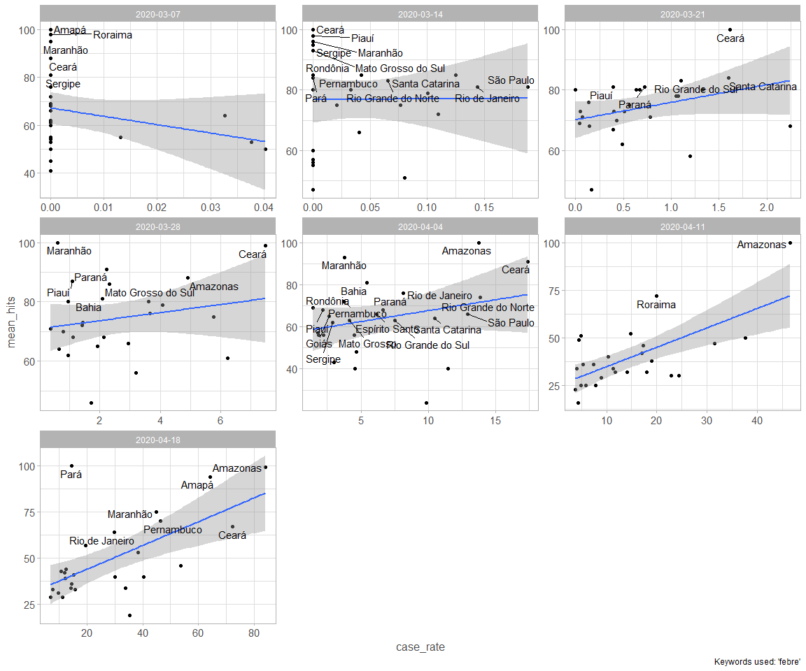
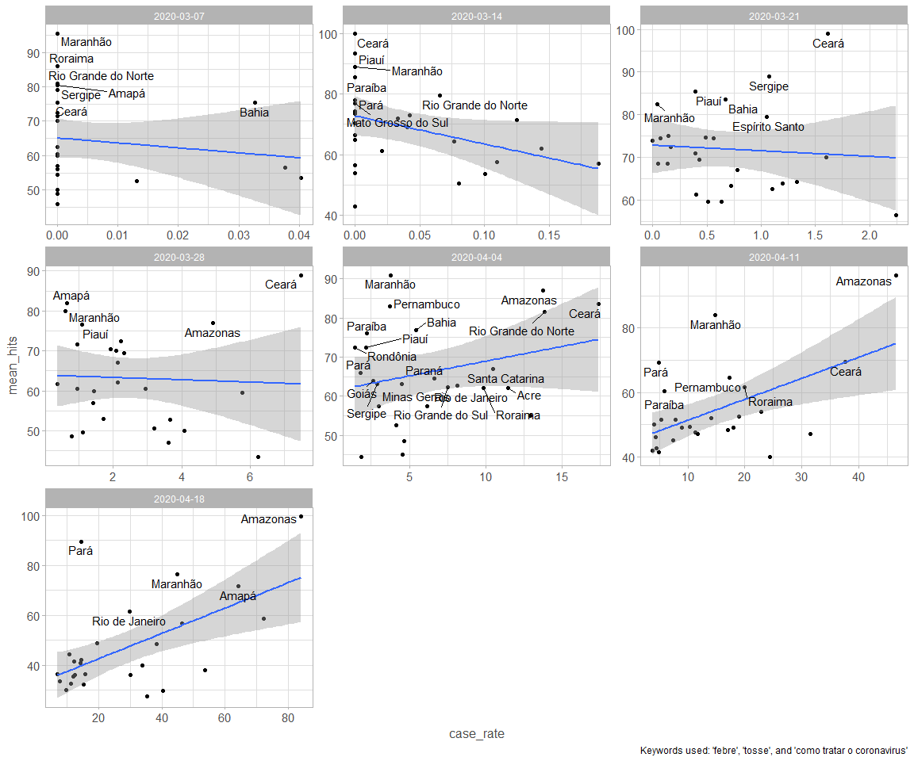
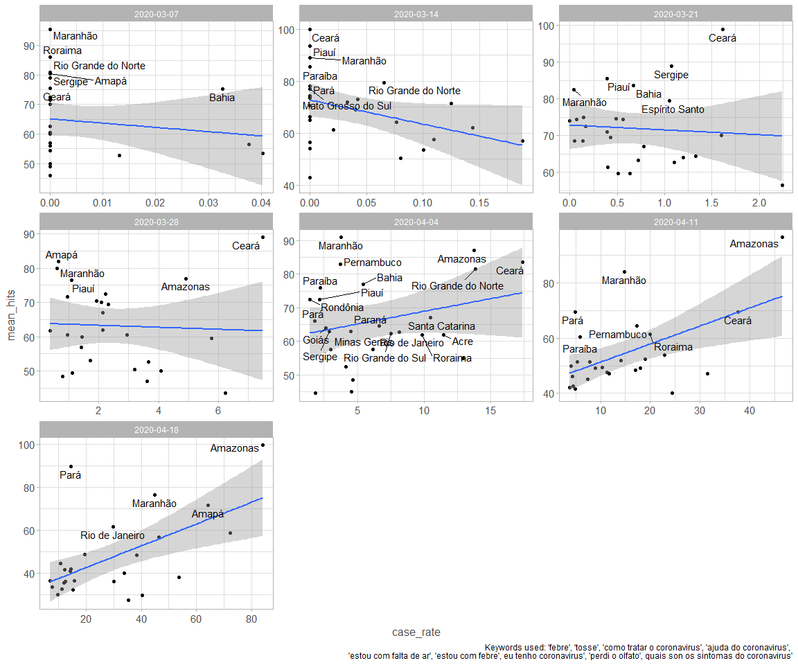
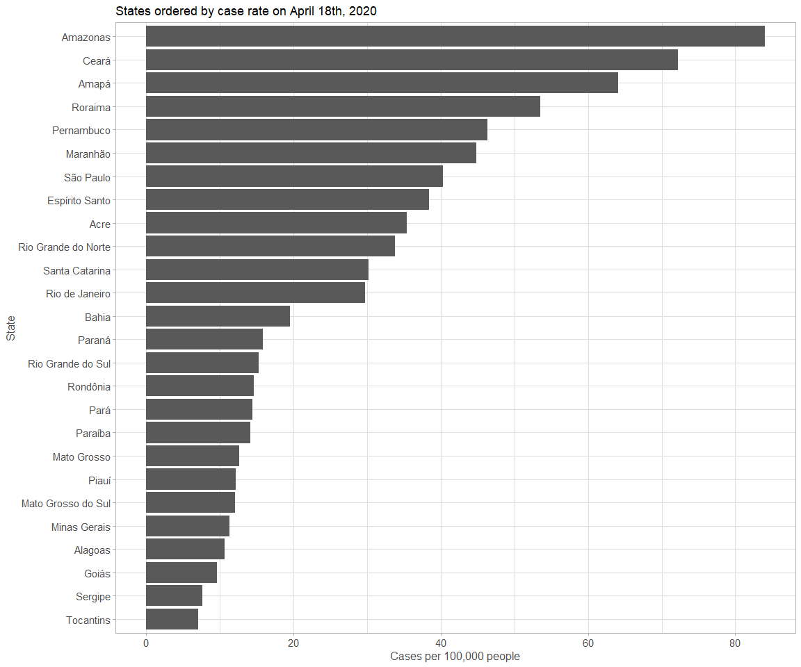
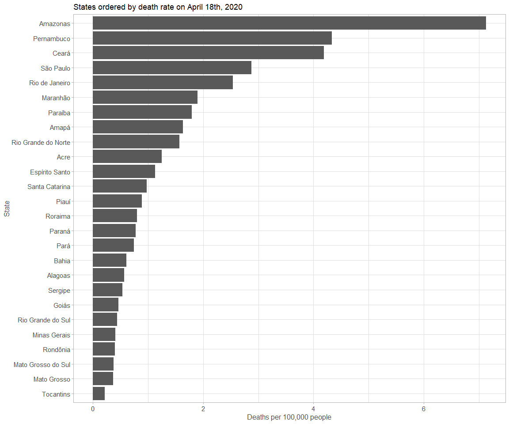
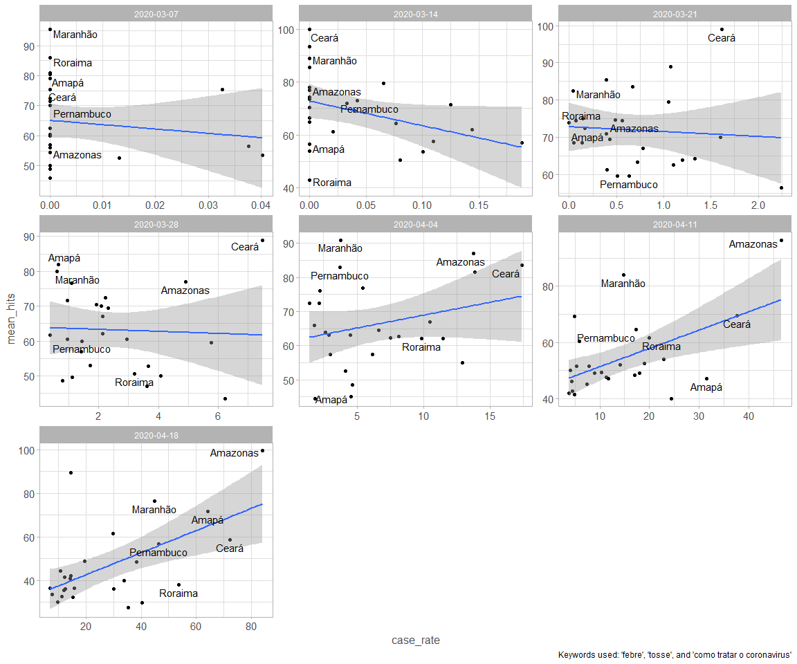
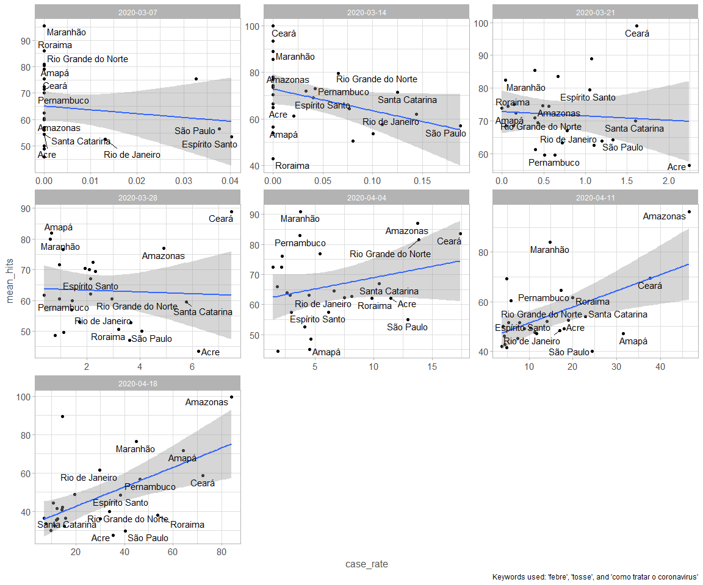
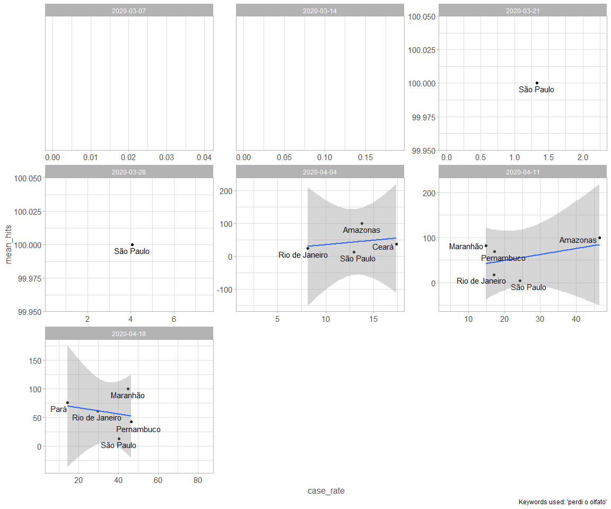

Create a variable for matching date intermediate of hits and date of covid-19 reporting

```r
data <- 
  data %>% 
  mutate(
    date_interm = as.Date(date_interm), 
    date_covid = as.Date(date_covid), 
    date_matched = if_else(date_interm == date_covid, 1L, 0L)
  )
```


# Plotting the figure for the keyword febre

```r
data %>% 
  filter(date_matched == 1, date_interm > "2020-02-29", keyword == "febre") %>%  
  group_by(date_interm, state) %>% 
  summarize(
    mean_hits = mean(hits, na.rm = TRUE), 
    case_rate = mean(case_rate, na.rm = TRUE)
  ) %>% 
  ggplot() + 
  geom_point(aes(case_rate, mean_hits)) + 
  geom_smooth(aes(case_rate, mean_hits), method = "lm") + 
  geom_text_repel(
    data = . %>% filter(mean_hits > 80 | (mean_hits > 60 & date_interm > "2020-04-01")), 
    aes(case_rate, mean_hits, label = state), 
    hjust=0.5, vjust=0.4
  ) + 
  facet_wrap(vars(date_interm), scales = "free") + 
  labs(
    caption = "Keywords used: 'febre'"
  )
```

<!-- -->

# Doing the same graph, but including now "tosse", "febre", and "como tratar o coronavirus"


```r
data %>% 
  filter(date_matched == 1, keyword %in% c("febre", "tosse", "como tratar o coronav<ed>rus"), date_interm > "2020-02-29") %>% 
  group_by(date_interm, state) %>% 
  summarize(
    mean_hits = mean(hits, na.rm = TRUE), 
    case_rate = mean(case_rate, na.rm = TRUE)
  ) %>% 
  ggplot() + 
  geom_point(aes(case_rate, mean_hits)) + 
  geom_smooth(aes(case_rate, mean_hits), method = "lm") + 
  geom_text_repel(
    data = . %>% filter(mean_hits > 75 | (mean_hits > 60 & date_interm >= "2020-04-01")), 
    aes(case_rate, mean_hits, label = state), 
    hjust=0.5, vjust=0.4
  ) + 
  facet_wrap(vars(date_interm), scales = "free") +
  labs(
    caption = "Keywords used: 'febre', 'tosse', and 'como tratar o coronavirus'"
  )
```

<!-- -->
 
# Same graph but using all keywords extracted


```r
data %>% 
  filter(date_matched == 1, keyword %in% c("febre", "tosse", "como tratar o coronav<ed>rus"), date_interm > "2020-02-29") %>% 
  group_by(date_interm, state) %>% 
  summarize(
    mean_hits = mean(hits, na.rm = TRUE), 
    case_rate = mean(case_rate, na.rm = TRUE)
  ) %>% 
  ggplot() + 
  geom_point(aes(case_rate, mean_hits)) + 
  geom_smooth(aes(case_rate, mean_hits), method = "lm") + 
  geom_text_repel(
    data = . %>% filter(mean_hits > 75 | (mean_hits > 60 & date_interm >= "2020-04-01")), 
    aes(case_rate, mean_hits, label = state), 
    hjust=0.5, vjust=0.4
  ) + 
  facet_wrap(vars(date_interm), scales = "free") +
  labs(
    caption = "Keywords used: 'febre', 'tosse', 'como tratar o coronavirus', 'ajuda do coronavirus', 
    'estou com falta de ar', 'estou com febre', eu tenho coronavirus', 'perdi o olfato', quais son os sintomas do coronavirus'"
  )
```

<!-- -->


# Which are the states with the largest case rate on April 18th?


```r
data %>% 
  filter(date_covid == "2020-04-18") %>% 
  count(case_rate, state) %>% 
  arrange(desc(case_rate)) %>% 
  ggplot()+ 
  geom_col(aes(fct_reorder(state, case_rate), case_rate)) +
  coord_flip() + 
  labs(
    title = "States ordered by case rate on April 18th, 2020", 
    x = "State", 
    y = "Cases per 100,000 people"
  )
```

<!-- -->

# Which are the states with the largest death rate on April 18th?


```r
data %>% 
  filter(date_covid == "2020-04-18") %>% 
  count(death_rate, state) %>% 
  arrange(desc(death_rate)) %>% 
  ggplot()+ 
  geom_col(aes(fct_reorder(state, death_rate), death_rate)) +
  coord_flip() + 
  labs(
    title = "States ordered by death rate on April 18th, 2020", 
    x = "State", 
    y = "Deaths per 100,000 people"
  )
```

<!-- -->


# Second graph (3 terms) only highlighting the most affected states on April 18th

## Top 6 states

```r
top_6_states <- 
  data %>% 
  filter(date_covid == "2020-04-18") %>% 
  count(case_rate, state) %>% 
  arrange(desc(case_rate)) %>% 
  head(6) %>% pull(state) 

data %>% 
  filter(date_matched == 1, keyword %in% c("febre", "tosse", "como tratar o coronav<ed>rus"), date_interm > "2020-02-29") %>% 
  group_by(date_interm, state) %>% 
  summarize(
    mean_hits = mean(hits, na.rm = TRUE), 
    case_rate = mean(case_rate, na.rm = TRUE)
  ) %>% 
  ggplot() + 
  geom_point(aes(case_rate, mean_hits)) + 
  geom_smooth(aes(case_rate, mean_hits), method = "lm") + 
  geom_text_repel(
    data = . %>% filter(state %in% top_6_states), 
    aes(case_rate, mean_hits, label = state), 
    hjust=0.5, vjust=0.4
  ) + 
  facet_wrap(vars(date_interm), scales = "free") +
  labs(
    caption = "Keywords used: 'febre', 'tosse', and 'como tratar o coronavirus'"
  )
```

<!-- -->

## Top 12 states

```r
top_12_states <- 
  data %>% 
  filter(date_covid == "2020-04-18") %>% 
  count(case_rate, state) %>% 
  arrange(desc(case_rate)) %>% 
  head(12) %>% pull(state) 

data %>% 
  filter(date_matched == 1, keyword %in% c("febre", "tosse", "como tratar o coronav<ed>rus"), date_interm > "2020-02-29") %>% 
  group_by(date_interm, state) %>% 
  summarize(
    mean_hits = mean(hits, na.rm = TRUE), 
    case_rate = mean(case_rate, na.rm = TRUE)
  ) %>% 
  ggplot() + 
  geom_point(aes(case_rate, mean_hits)) + 
  geom_smooth(aes(case_rate, mean_hits), method = "lm") + 
  geom_text_repel(
    data = . %>% filter(state %in% top_12_states), 
    aes(case_rate, mean_hits, label = state), 
    hjust=0.5, vjust=0.4
  ) + 
  facet_wrap(vars(date_interm), scales = "free") +
  labs(
    caption = "Keywords used: 'febre', 'tosse', and 'como tratar o coronavirus'"
  )
```

<!-- -->

# Plotting the keyword "I can't smell"


```r
data %>% 
  filter(date_matched == 1, date_interm > "2020-02-29", keyword == "perdi o olfato") %>%  
  group_by(date_interm, state) %>% 
  summarize(
    mean_hits = mean(hits, na.rm = TRUE), 
    case_rate = mean(case_rate, na.rm = TRUE)
  ) %>% 
  ggplot() + 
  geom_point(aes(case_rate, mean_hits)) + 
  geom_smooth(aes(case_rate, mean_hits), method = "lm") + 
  geom_text_repel(
    aes(case_rate, mean_hits, label = state), 
    hjust=0.5, vjust=0.4
  ) + 
  facet_wrap(vars(date_interm), scales = "free") + 
  labs(
    caption = "Keywords used: 'perdi o olfato'"
  )
```

<!-- -->
