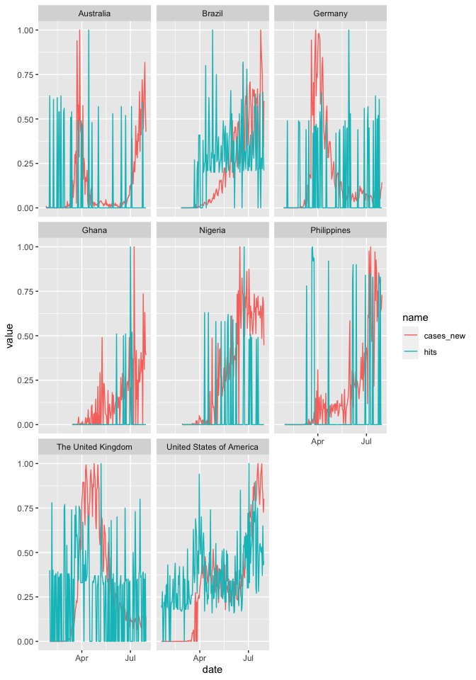
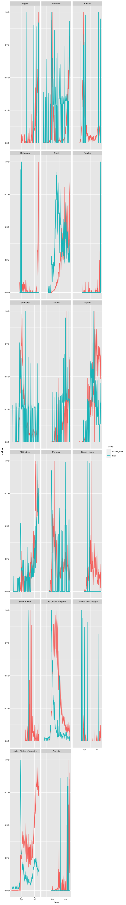
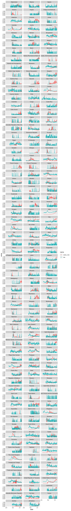

Results show timeseries of new cases and google hits of different search terms. All values are standardized between 0 and 1 (for now) to help with plotting.


# Time Series

## I can't smell


```r
trends_df %>%
  filter(keyword == "i can't smell") %>%
  filter(!is.na(Country)) %>%
  dplyr::select(date, Country, hits, cases_new) %>%
  pivot_longer(cols = -c(date, Country)) %>%
  
  group_by(Country, name) %>%
  mutate(value = value / max(value, na.rm=T)) %>%
  ungroup() %>%
  
  ggplot() +
  geom_line(aes(x = date, y = value, color = name, group = name)) +
  facet_wrap(~Country,
             ncol = 3)
```

<!-- -->


## Loss of Smell


```r
trends_df %>%
  filter(keyword == "loss of smell") %>%
  filter(!is.na(Country)) %>%
  dplyr::select(date, Country, hits, cases_new) %>%
  pivot_longer(cols = -c(date, Country)) %>%
  
  group_by(Country, name) %>%
  mutate(value = value / max(value, na.rm=T)) %>%
  ungroup() %>%
  
  ggplot() +
  geom_line(aes(x = date, y = value, color = name, group = name)) +
  facet_wrap(~Country,
             ncol = 3)
```

<!-- -->

## Fever


```r
trends_df %>%
  filter(keyword == "fever") %>%
  filter(!is.na(Country)) %>%
  dplyr::select(date, Country, hits, cases_new) %>%
  pivot_longer(cols = -c(date, Country)) %>%
  
  group_by(Country, name) %>%
  mutate(value = value / max(value, na.rm=T)) %>%
  ungroup() %>%
  
  ggplot() +
  geom_line(aes(x = date, y = value, color = name, group = name)) +
  facet_wrap(~Country,
             ncol = 3)
```

<!-- -->

