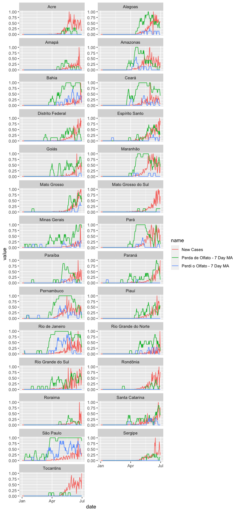
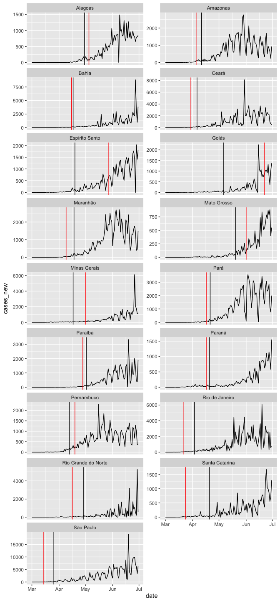
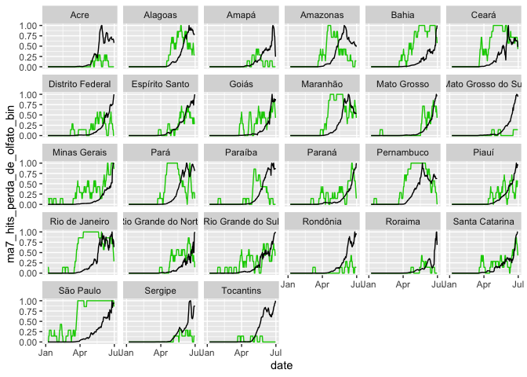

# Time Series


```r
trends_df %>%
  group_by(state) %>%
  mutate(cases_new = cases_new / max(cases_new, na.rm = T)) %>%
  ungroup() %>%
  dplyr::select(date, state, cases_new, ma7_hits_perda_de_olfato_bin, ma7_hits_perdi_o_olfato_bin) %>%
  pivot_longer(cols = -c(date, state)) %>%
  mutate(name = case_when(name == "cases_new" ~ "New Cases",
                          name == "ma7_hits_perda_de_olfato_bin" ~ "Perda de Olfato - 7 Day MA",
                          name == "ma7_hits_perdi_o_olfato_bin" ~ "Perdi o Olfato - 7 Day MA")) %>%
  ggplot() +
  geom_line(aes(x = date, y = value, group = name, color = name)) + 
  facet_wrap(~state, 
             scale = "free_y",
             ncol = 2)
```

<!-- -->

# Red Light - Predicting Increase

We plot the first day "I can't smell" appears in red and the day with 1,000 cumulative cases in black.


```r
trends_df %>%
  filter(date >= "2020-03-01") %>%
  group_by(state) %>%
  mutate(red_light_date = min(date[hits_perdi_o_olfato > 0 & 
                                     date >= "2020-02-01" &
                                     date <= "2020-06-30"])) %>%
  mutate(cases_1000 = min(date[cases > 1000])) %>%
  ungroup() %>%
  filter(!is.na(as.character(red_light_date))) %>%
  
  ggplot(aes(x = date, y= cases_new)) +
  geom_line() +
  geom_vline(aes(xintercept = red_light_date), color = "red") +
  geom_vline(aes(xintercept = cases_1000), color = "black") +
  facet_wrap(~state, 
             scales = "free_y",
             ncol = 2) 
```

<!-- -->

# Green Light - Predicting Decrease

# 7 Day Moving Average: New Cases and Loss of Smell


```r
trends_df %>%
  group_by(state) %>%
  mutate(ma7_cases_new = ma7_cases_new/max(ma7_cases_new, na.rm=T)) %>%
  ggplot() +
  geom_line(aes(x = date,
                y = ma7_hits_perda_de_olfato_bin),
            color = "green3") +
  geom_line(aes(x = date,
                y = ma7_cases_new)) +
  facet_wrap(~state)
```

```
## group_by: one grouping variable (state)
```

```
## mutate (grouped): changed 2,936 values (60%) of 'ma7_cases_new' (0 new NA)
```

```
## Warning: Removed 6 row(s) containing missing values (geom_path).

## Warning: Removed 6 row(s) containing missing values (geom_path).
```

<!-- -->


