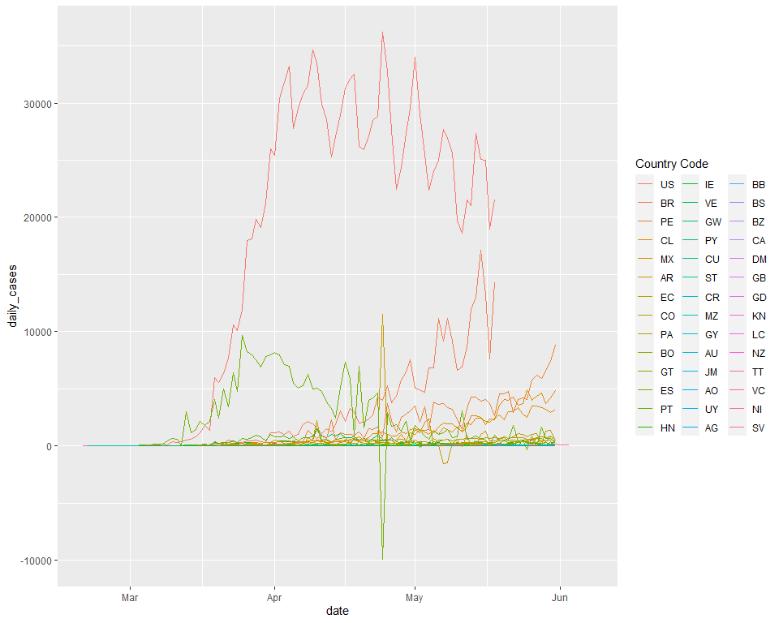
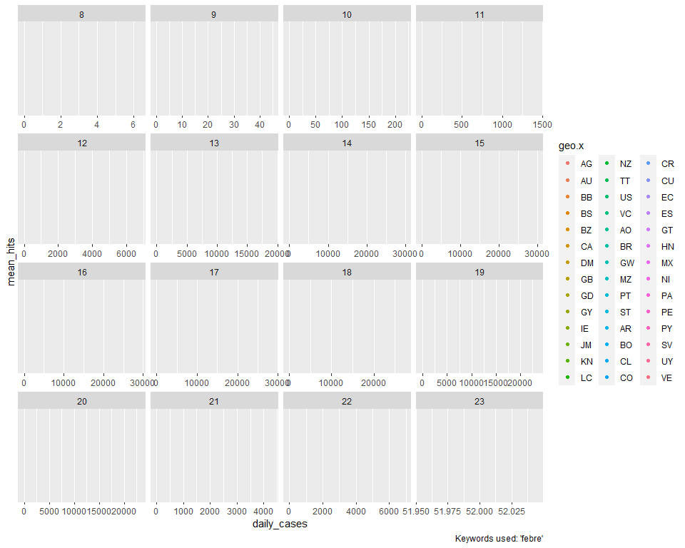

```r
#user's file path
if(Sys.info()[["user"]] == "wb537287") dropbox_file_path <- "/Users/wb537287/Dropbox/COVID Social Media Analysis"

#load libraries
library(tidyverse)
library(gridExtra)
library(lubridate)
library(readstata13)
library(tidylog)
library(ggrepel)

#import datasets
data_por <- 
  read.csv(
    file.path(
      dropbox_file_path,
      "Data_WB_Global/Country_Level_Cleaned/Portuguese_Cleaned/Portuguese_countries_clean.csv"
    ), 
    encoding = "UTF-8"
  )


data_en <- 
  read.csv(
    file.path(
      dropbox_file_path,
      "Data_WB_Global/Country_Level_Cleaned/English_Cleaned/English_countries_clean.csv"
    ), 
    encoding = "UTF-8"
  )

data_sp <- 
  read.csv(
    file.path(
      dropbox_file_path,
      "Data_WB_Global/Country_Level_Cleaned/Spanish_Cleaned/Spanish_countries_clean.csv"
    ), 
    encoding = "UTF-8"
  )
```

Merge datasets

```r
data <- rbind(data_en, data_por, data_sp)
```


Clean dates

```r
data <- 
  data %>% 
  mutate(date = as.Date(date))

data <- 
  data %>% 
  mutate(
    week_number = week(date), 
    day = day(date), 
    month = month(date), 
    wday = wday(date, label = TRUE)
  )
```

Find countries that show up under "I can't smell"

```r
countries_cant_smell <-  
  data %>% 
  filter(keyword %in% c("I can't smell", "Perdi o olfato", "no puedo oler")) %>% 
  filter(!is.na(hits)) %>% 
  count(geo.x) %>%
  pull(geo.x)
```

Find the date in which the country first shows under "I can't smell"

```r
countries_cant_smell_date <- 
  data %>% 
  filter(keyword %in% c("I can't smell", "Perdi o olfato", "no puedo oler"), geo.x %in% countries_cant_smell) %>% 
  filter(!is.na(hits), date > "2020-03-01") %>% 
  group_by(geo.x) %>% 
  summarize(
    first_date_cant_smell = min(date)
  )

# Add a ranking
countries_cant_smell_date <- 
  countries_cant_smell_date %>% 
  arrange(first_date_cant_smell) %>% 
  mutate(ranking_cant_smell = rank(first_date_cant_smell))
```

# daily_cases at Country level (En)


```r
data %>% 
  ggplot(aes(date, daily_cases, group = geo.x, color = fct_reorder2(geo.x, date, daily_cases))) + 
  geom_line() + 
  labs(color = "Country Code")
```

<!-- -->

# daily_deaths at Country level (En)


```r
data %>% 
  ggplot(aes(date, daily_deaths, group = geo.x, color = fct_reorder2(geo.x, date, daily_deaths))) + 
  geom_line() + 
  labs(color = "Country Code")
```

<!-- -->

# Across countries: in 1st person


```r
data %>% 
  filter(categories == "in_1st_person") %>% 
  group_by(geo.x, week_number) %>% 
  summarize(
    mean_hits = mean(hits, na.rm = TRUE), 
    daily_cases = mean(daily_cases, na.rm = TRUE)
  ) %>% 
  ggplot() + 
  geom_point(aes(daily_cases, mean_hits, color = geo.x)) + 
  geom_smooth(aes(daily_cases, mean_hits), method = "lm") + 
  geom_text_repel(
    data = . %>% filter(mean_hits > 80), 
    aes(daily_cases, mean_hits, label = geo.x), 
    hjust=0.5, vjust=0.4
  ) + 
  facet_wrap(vars(week_number), scales = "free_x") + 
  labs(
    caption = "Keywords used: 'febre'"
  )
```

<!-- -->

# Across countries: in 1st person or symptoms


```r
data %>% 
  filter(categories %in% c("in_1st_person", "symptoms")) %>% 
  group_by(geo.x, week_number) %>% 
  summarize(
    mean_hits = mean(hits, na.rm = TRUE), 
    daily_cases = mean(daily_cases, na.rm = TRUE)
  ) %>% 
  ggplot() + 
  geom_point(aes(daily_cases, mean_hits, color = geo.x)) + 
  geom_smooth(aes(daily_cases, mean_hits), method = "lm") + 
  geom_text_repel(
    data = . %>% filter(mean_hits > 80), 
    aes(daily_cases, mean_hits, label = geo.x), 
    hjust=0.5, vjust=0.4
  ) + 
  facet_wrap(vars(week_number), scales = "free_x") + 
  labs(
    caption = "Keywords used: 'febre'"
  )
```

<!-- -->

* Issue: the US has so many more daily_cases that there is not much variation in the x axis across countries

## Across countries: in 1st person or symptoms (excluding the U.S.)


```r
data %>% 
  filter(categories %in% c("in_1st_person", "symptoms"), geo.x != "US") %>% 
  group_by(geo.x, week_number) %>% 
  summarize(
    mean_hits = mean(hits, na.rm = TRUE), 
    daily_cases = mean(daily_cases, na.rm = TRUE)
  ) %>% 
  ggplot() + 
  geom_point(aes(daily_cases, mean_hits, color = geo.x)) + 
  geom_smooth(aes(daily_cases, mean_hits), method = "lm") + 
  geom_text_repel(
    data = . %>% filter(mean_hits > 80), 
    aes(daily_cases, mean_hits, label = geo.x), 
    hjust=0.5, vjust=0.4
  ) + 
  facet_wrap(vars(week_number), scales = "free_x") + 
  labs(
    caption = "Keywords used: 'febre'"
  )
```

<!-- -->

# I can't smell at the weekly level


```r
data %>% 
  filter(keyword %in% c("I can't smell", "Perdi o olfato", "no puedo oler")) %>% 
  group_by(week_number, geo.x) %>% 
  summarize(
    mean_hits = mean(hits, na.rm = TRUE), 
    daily_cases = mean(daily_cases, na.rm = TRUE)
  ) %>% 
  ggplot() + 
  geom_point(aes(daily_cases, mean_hits, color = geo.x)) + 
  geom_smooth(aes(daily_cases, mean_hits), method = "lm") + 
  geom_text_repel(
    aes(daily_cases, mean_hits, label = geo.x), 
    hjust=0.5, vjust=0.4
  ) + 
  facet_wrap(vars(week_number), scales = "free_x") +
  labs(
    caption = "Keywords used: 'I can't smell'"
  )
```

<!-- -->

* It's hard for this alarm system to work at the country level, because it's quite likely that the term shows overall at the country level.


# Case rate and death rate per Country

## Case rate: Highlighting the countries that show up under I can't smell at any point

```r
data %>% 
  filter(!is.na(geo.x), !is.na(case_rate)) %>% 
  count(case_rate, date, geo.x) %>% 
  ggplot() +
  geom_line(aes(date, case_rate, group = geo.x, color = fct_reorder2(geo.x, date, case_rate))) +
  geom_line(
    data = . %>% filter(geo.x %in% countries_cant_smell),
    aes(date, case_rate, group = geo.x, color = fct_reorder2(geo.x, date, case_rate)), size = 2) +
  labs(
    title = "Case rate per Country",
    color = "Country"
  )
```

<!-- -->

## daily_cases: Highlighting the countries that show up under I can't smell at any point

```r
data %>% 
  filter(!is.na(geo.x), !is.na(case_rate)) %>% 
  count(daily_cases, date, geo.x) %>% 
  ggplot() +
  geom_line(aes(date, daily_cases, group = geo.x, color = fct_reorder2(geo.x, date, daily_cases))) +
  geom_line(
    data = . %>% filter(geo.x %in% countries_cant_smell),
    aes(date, daily_cases, group = geo.x, color = fct_reorder2(geo.x, date, daily_cases)), size = 2) +
  labs(
    title = "daily_cases per Country",
    color = "Countries"
  )
```

<!-- -->

## Death rate: Highlighting the countries that show up under I can't smell at any point

```r
data %>% 
  filter(!is.na(geo.x), !is.na(death_rate)) %>% 
  count(death_rate, date, geo.x) %>% 
  ggplot() +
  geom_line(aes(date, death_rate, group = geo.x, color = fct_reorder2(geo.x, date, death_rate))) +
  geom_line(
    data = . %>% filter(geo.x %in% countries_cant_smell),
    aes(date, death_rate, group = geo.x, color = fct_reorder2(geo.x, date, death_rate)), size = 2) +
  labs(
    title = "Death rate per Countries",
    color = "Country"
  )
```

<!-- -->

## daily_deaths: Highlighting the countries that show up under I can't smell at any point

```r
data %>% 
  filter(!is.na(geo.x), !is.na(daily_deaths)) %>% 
  count(daily_deaths, date, geo.x) %>% 
  ggplot() +
  geom_line(aes(date, daily_deaths, group = geo.x, color = fct_reorder2(geo.x, date, daily_deaths))) +
  geom_line(
    data = . %>% filter(geo.x %in% countries_cant_smell),
    aes(date, daily_deaths, group = geo.x, color = fct_reorder2(geo.x, date, daily_deaths)), size = 2) +
  labs(
    title = "daily_deaths per Country",
    color = "Country"
  )
```

<!-- -->

## Date of showing up "I can't smell"


```r
data %>% 
  filter(!is.na(geo.x), !is.na(death_rate), geo.x %in% countries_cant_smell) %>% 
  count(death_rate, date, geo.x) %>% 
  ggplot() +
  geom_line(aes(date, death_rate, group = geo.x, color = fct_reorder2(geo.x, date, death_rate))) +
  geom_vline(
    data = countries_cant_smell_date, 
    aes(xintercept = first_date_cant_smell, group = geo.x, color = geo.x)
  ) +
  geom_label_repel(
    data = countries_cant_smell_date, 
    aes(first_date_cant_smell, y = 80, label = geo.x), 
    hjust=0.5, vjust=0.4
  ) + 
  labs(
    title = "Death rate per Country",
    color = "Country"
  )
```

<!-- -->


## Date of showing up "I can't smell" & daily_deaths (instead of death rate)


```r
data %>% 
  filter(!is.na(geo.x), !is.na(death_rate), geo.x %in% countries_cant_smell) %>% 
  count(daily_deaths, date, geo.x) %>% 
  ggplot() +
  geom_line(aes(date, daily_deaths, group = geo.x, color = fct_reorder2(geo.x, date, daily_deaths))) +
  geom_vline(
    data = countries_cant_smell_date, 
    aes(xintercept = first_date_cant_smell, group = geo.x)
  ) +
  geom_label_repel(
    data = countries_cant_smell_date, 
    aes(first_date_cant_smell, y = 4500, label = geo.x), 
    hjust=0.5, vjust=0.4
  ) + 
  labs(
    title = "daily_deaths per Country",
    color = "Country"
  )
```

<!-- -->


## Graph of current death rate distinguishing by date of I can't smell


```r
data %>% 
  left_join(countries_cant_smell_date, by = "geo.x") %>% 
  mutate(cant_smell_appears = if_else(!is.na(first_date_cant_smell), 1L, 0L) %>% as.character()) %>% 
  filter(date == "2020-05-18", !is.na(death_rate)) %>% 
  count(daily_deaths, geo.x, cant_smell_appears, first_date_cant_smell) %>% 
  arrange(desc(daily_deaths)) %>% 
  ggplot()+ 
  geom_col(aes(fct_reorder(geo.x, daily_deaths), daily_deaths, fill = cant_smell_appears)) +
  geom_label_repel(
    aes(
      x = as.character(geo.x), 
      y = daily_deaths, 
      label = as.character(first_date_cant_smell)
    ), 
    position = position_fill(vjust = 0)
  ) + 
  labs(
    color = "Country category"
  ) + 
  coord_flip() + 
  labs(
    title = "Countries ordered by daily_deaths on May 18th, 2020", 
    x = "Country", 
    y = "daily_deaths"
  )
```

<!-- -->


```r
data %>% 
  left_join(countries_cant_smell_date, by = "geo.x") %>% 
  mutate(cant_smell_appears = if_else(!is.na(first_date_cant_smell), 1L, 0L) %>% as.character()) %>% 
  filter(date == "2020-05-18", !is.na(death_rate)) %>% 
  count(death_rate, geo.x, cant_smell_appears, first_date_cant_smell) %>% 
  arrange(desc(death_rate)) %>% 
  ggplot()+ 
  geom_col(aes(fct_reorder(geo.x, death_rate), death_rate, fill = cant_smell_appears)) +
  geom_label_repel(
    aes(
      x = as.character(geo.x), 
      y = death_rate, 
      label = as.character(first_date_cant_smell)
    ),  
    position = position_fill(vjust = 0.5)
  ) + 
  coord_flip() + 
  labs(
    title = "Countries ordered by death rate on May 18th, 2020", 
    x = "Country", 
    y = "Daily Deaths per 100,000 people"
  )
```

<!-- -->


Troubleshooting

```r
data_por %>% 
  filter(daily_cases < 0)
```

```
##       X       date hits                              keyword geo.x      time
## 1  1279 2020-05-02   25               profissionais de saúde    PT today 3-m
## 2  1280 2020-05-02    0                    Isolamento social    PT today 3-m
## 3  1281 2020-05-02   10                                tosse    PT today 3-m
## 4  1282 2020-05-02    0                Estou com falta de ar    PT today 3-m
## 5  1283 2020-05-02   17                                febre    PT today 3-m
## 6  1284 2020-05-02    0                        dor nos olhos    PT today 3-m
## 7  1285 2020-05-02    0                 teste de coronavírus    PT today 3-m
## 8  1286 2020-05-02    4                      Eu fico em casa    PT today 3-m
## 9  1287 2020-05-02   59                              cansaço    PT today 3-m
## 10 1288 2020-05-02    0 quais são os sintomas do coronavírus    PT today 3-m
## 11 1289 2020-05-02   46                              medicos    PT today 3-m
## 12 1290 2020-05-02    0              dificuldade ao respirar    PT today 3-m
## 13 1291 2020-05-02    4                          coronavírus    PT today 3-m
## 14 1292 2020-05-02    7                           cloroquina    PT today 3-m
## 15 1293 2020-05-02    0                  isolamento vertical    PT today 3-m
## 16 1294 2020-05-02    0                      estou com febre    PT today 3-m
## 17 1295 2020-05-02    0                      perda de olfato    PT today 3-m
## 18 1296 2020-05-02    0                         volta brasil    PT today 3-m
##    gprop category country_name geo.y popData2018 totaldeaths totalcases
## 1    web        0     Portugal    PT    10281762        1023      25190
## 2    web        0     Portugal    PT    10281762        1023      25190
## 3    web        0     Portugal    PT    10281762        1023      25190
## 4    web        0     Portugal    PT    10281762        1023      25190
## 5    web        0     Portugal    PT    10281762        1023      25190
## 6    web        0     Portugal    PT    10281762        1023      25190
## 7    web        0     Portugal    PT    10281762        1023      25190
## 8    web        0     Portugal    PT    10281762        1023      25190
## 9    web        0     Portugal    PT    10281762        1023      25190
## 10   web        0     Portugal    PT    10281762        1023      25190
## 11   web        0     Portugal    PT    10281762        1023      25190
## 12   web        0     Portugal    PT    10281762        1023      25190
## 13   web        0     Portugal    PT    10281762        1023      25190
## 14   web        0     Portugal    PT    10281762        1023      25190
## 15   web        0     Portugal    PT    10281762        1023      25190
## 16   web        0     Portugal    PT    10281762        1023      25190
## 17   web        0     Portugal    PT    10281762        1023      25190
## 18   web        0     Portugal    PT    10281762        1023      25190
##    daily_cases daily_deaths    categories case_rate death_rate
## 1         -161           16     resources -1.565879  0.1556154
## 2         -161           16    prevention -1.565879  0.1556154
## 3         -161           16      symptoms -1.565879  0.1556154
## 4         -161           16 in_1st_person -1.565879  0.1556154
## 5         -161           16      symptoms -1.565879  0.1556154
## 6         -161           16      symptoms -1.565879  0.1556154
## 7         -161           16      symptoms -1.565879  0.1556154
## 8         -161           16 in_1st_person -1.565879  0.1556154
## 9         -161           16  consequences -1.565879  0.1556154
## 10        -161           16 in_1st_person -1.565879  0.1556154
## 11        -161           16     resources -1.565879  0.1556154
## 12        -161           16      symptoms -1.565879  0.1556154
## 13        -161           16         virus -1.565879  0.1556154
## 14        -161           16     resources -1.565879  0.1556154
## 15        -161           16    prevention -1.565879  0.1556154
## 16        -161           16 in_1st_person -1.565879  0.1556154
## 17        -161           16      symptoms -1.565879  0.1556154
## 18        -161           16 in_1st_person -1.565879  0.1556154
##    fatalities_per_case
## 1           0.04061135
## 2           0.04061135
## 3           0.04061135
## 4           0.04061135
## 5           0.04061135
## 6           0.04061135
## 7           0.04061135
## 8           0.04061135
## 9           0.04061135
## 10          0.04061135
## 11          0.04061135
## 12          0.04061135
## 13          0.04061135
## 14          0.04061135
## 15          0.04061135
## 16          0.04061135
## 17          0.04061135
## 18          0.04061135
```

